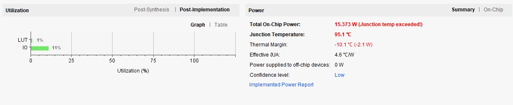

# Lab1 运算器和寄存器

## 1.算术逻辑单元

### 逻辑设计

ALU 包括加减运算和 AND, OR, NOT, XOR 四种逻辑操通过作，通过 sel 信号选择运算种类，输出结果和 ZF, CF,OF 三种标志符。

对于逻辑运算，直接使用 Verilog 自带的逻辑运算符。

电路图如下：

<div align="center">

</div>

### 核心代码

对于加减运算，实现一个**可设置位宽参数**的**超前进位加法器**，代码如下：

```
module CLA_Adder #(WIDTH=32) (
	input [WIDTH-1:0] a,
    input [WIDTH-1:0] b,
    input cin,
    output [WIDTH-1:0] s,
    output cout,
    output overflow
    );

    wire [WIDTH-1:0] p,g,c;
    wire [WIDTH:0] term [WIDTH:0];

    generate
        genvar i, j;
        for (i = 0; i < WIDTH; i = i + 1) begin
            assign p[i] = a[i] | b[i];
            assign g[i] = a[i] & b[i];
        end
        for (i = 0; i < WIDTH; i = i + 1) begin
            for (j = 0; j < i; j = j + 1) begin
                assign term[i][j] = &{ p[i:i-j], g[i-j-1] };
            end
            assign term[i][i] = &{ p[i:0], cin };
        end
        for (i = 0; i < WIDTH; i = i + 1) begin
            assign c[i] = |{ g[i], term[i][i:0] };
        end
        assign s[0] = ^{ a[0], b[0], cin };
        for (i = 1; i < WIDTH; i = i + 1) begin
            assign s[i] = ^{ a[i], b[i], c[i-1] };
        end
    endgenerate

    assign cout = c[WIDTH-1];
    assign overflow = c[WIDTH-1] ^ c[WIDTH-2];
	
endmodule
```

减法则使用加补码的方式实现。

ALU 整体实现代码如下：

```
module ALU #(WIDTH=6) (
    input [2:0] sel,
    input [WIDTH-1:0] a,
    input [WIDTH-1:0] b,
    output [WIDTH-1:0] s,
    output ZF,
    output CF,
    output OF
    );
    // sel[0]=1 则位逻辑运算，否则为算术运算
    // 以下是各个运算的 sel 码
    // add 000
    // sub 010
    // and 001
    // or  011
    // not 101
    // xor 111

    parameter AND='b00, OR='b01, NOT='b10, XOR='b11;
    wire [WIDTH-1:0] add_sub_s;
    wire carry;

    CLA_Adder #(.WIDTH(WIDTH)) adder(
        .a(a),
        .b( b ^ {WIDTH{sel[1]}} ),
        .s(add_sub_s),
        .cin(sel[1]),
        .cout(carry),
        .overflow(OF)
        );
    
    reg [WIDTH-1:0] logical_s;
    always @(*) begin
        case (sel[2:1])
            AND: logical_s = a & b;
            OR:  logical_s = a | b;
            NOT: logical_s = ~ a;
            XOR: logical_s = a ^ b;
        endcase
    end

    assign s = sel[0] ? logical_s : add_sub_s;
    assign ZF = ~|s;
    assign CF = sel[1] ^ carry;

endmodule
```

### 仿真

仿真代码如下：

```
`timescale 1ns / 1ps

module ALU_tb;
    parameter WIDTH=6,
        ADD='b000,
        SUB='b010,
        AND='b001,
        OR ='b011,
        NOT='b101,
        XOR='b111;

    reg [WIDTH-1:0] a,b;
    reg [2:0] sel;
    wire [WIDTH-1:0] s;
    wire [WIDTH:0] s_add_ext,s_sub_ext;
    wire ZF,OF,CF;
    integer i,j;

    ALU #(.WIDTH(WIDTH)) DUT(
        .sel(sel),
        .a(a),
        .b(b),
        .s(s),
        .ZF(ZF),
        .OF(OF),
        .CF(CF)
        );

    // 用于产生参考 CF
    assign s_add_ext = {0,a}+{0,b};
    assign s_sub_ext = {0,a}+{0,~b}+1;

    // 遍历测试
    initial begin
        for (i=0;i<='b111111;i=i+1) begin
            for (j=0;j<='b111111;j=j+1) begin
                a=i;
                b=j;
                sel=ADD;
                #1;
                if( (s != a + b) || 
                    (s_add_ext[WIDTH] != CF) ||   // 测试进位
                    ($signed(s) != $signed(a) + $signed(b) && ~OF) ||  // 测试溢出
                    (s == 0 && ~ZF)) begin   // 测试零标志
                    $display("error, %d + %d != %d",$signed(a),$signed(b),$signed(s));
                    $finish;
                end
                sel=SUB;
                #1;
                if( (s != a - b) || 
                    (s_sub_ext[WIDTH] == CF) ||   // 测试借位
                    ($signed(s) != $signed(a) - $signed(b) && ~OF) ||  // 测试溢出
                    (s == 0 && ~ZF)) begin   // 测试零标志
                    $display("error, %d - %d != %d",$signed(a),$signed(b),$signed(s));
                    $finish;
                end
                sel=AND;
                #1;
                if((s != (a & b)) || (s == 0 && ~ZF)) begin
                    $display("error, %d & %d != %d",$signed(a),$signed(b),$signed(s));
                    $finish;
                end
                sel=OR;
                #1;
                if((s != (a | b)) || (s == 0 && ~ZF)) begin
                    $display("error, %d | %d != %d",$signed(a),$signed(b),$signed(s));
                    $finish;
                end
                sel=NOT;
                #1;
                if((s != ~a) || (s == 0 && ~ZF)) begin
                    $display("error, ~ %d != %d",$signed(a),$signed(s));
                    $finish;
                end
                sel=XOR;
                #1;
                if((s != (a ^ b)) || (s == 0 && ~ZF)) begin
                    $display("error, %d ^ %d != %d",$signed(a),$signed(b),$signed(s));
                    $finish;
                end
            end
        end
        $display("pass");
        $finish;
    end
	
endmodule
```

仿真过程不仅产生波形图，也自动对正确性进行了检验，通过测试则会显示 **pass**, 如下图：

<div align="center">

</div>

波形图如下：

<div align="center">

</div>

### 结果分析

下载展示：

<div align="center">

</div>

本设计使用的硬件资源和功耗如下：

<div align="center">

</div>

ALU 是处理器的关键部分，加法器的速度直接影响了其运算延迟。采用超前进位加法器可以大幅改善其速度。但单纯的超前进位加法器在位宽较高时占用资源过大，并且有显著的扇入扇出效应，反而会限制时序电路的运行频率。因此可采用选择进位加法器配合超前进位达到资源和速度的平衡。受限于实验中**可自由指定位宽**的限制，本实现没有使用选择进位的技术。

## 2.寄存器

### 逻辑设计

寄存器被设计为带有使能控制和异步重置功能的上升沿触发的触发器。

电路图如下：

<div align="center">

</div>

### 核心代码

```
module Register #(WIDTH=6) (
    input clk,
    input rst,
    input en,
    input [WIDTH-1:0] in,
    output reg [WIDTH-1:0] out
    );

    always @(posedge clk or posedge rst) begin
        if (rst) begin
            out = 0;
        end
        else if (en) begin
            out = in;
        end
    end
endmodule
```

### 仿真

仿真代码如下：

```
`timescale 1ns / 1ps

module Register_tb;

    parameter WIDTH=32;
    reg rst,clk,en;
    reg [WIDTH-1:0] in;
    wire [WIDTH-1:0] out;

    Register #(.WIDTH(WIDTH)) DUT(
        .en(en),
        .clk(clk),
        .rst(rst),
        .in(in),
        .out(out)
        );

    integer i,last;

    initial begin
        clk=0;
        rst=1;
        #2 rst=0;

        for (i=0;i<20;i=i+1) begin
            in=$random;
            en=1;
            #1 clk=1;
            #1;
            if (out!=in) begin
                $display("error");
                $finish;
            end
            #1 clk=0;
            last=out;
            in=$random;
            en=0;
            #1 clk=1;
            #1;
            if (out!=last) begin
                $display("error");
                $finish;
            end
            #1 clk=0;
        end
        $display("pass");
        $finish;
    end

endmodule
```

仿真同时给出结果判定和波形图：

<div align="center">

</div>

波形图如下：

<div align="center">

</div>

### 结果分析

下载展示：

<div align="center">

</div>

本设计使用的硬件资源和功耗如下：

<div align="center">

</div>

## 3.a 比较器

### 逻辑设计

使用 ALU 的减法功能，并对产生的 ZF, CF, OF 等标志位进行组合逻辑即可得出结果。

电路设计如下：

<div align="center">

</div>

### 核心代码

```
module CMP #(WIDTH=6) (
    input [WIDTH-1:0] x,
    input [WIDTH-1:0] y,
    output ug,
    output ul,
    output sg,
    output sl,
    output eq
    );

    wire ZF,CF,OF;
    ALU #(.WIDTH(WIDTH)) cmp(
        .sel('b010),
        .a(x),
        .b(y),
        .CF(CF),
        .ZF(ZF),
        .OF(OF)
        );

    assign eq = &{ ~CF, ZF };

    assign ug = &{ ~CF, ~ZF };
    assign ul = &{  CF, ~ZF };

    wire sign;
    assign sign = ^{ ~CF, x[WIDTH-1], ~y[WIDTH-1] };
    assign sg = &{ ~sign, ~ZF };
    assign sl = &{ sign, ~ZF };

endmodule
```

### 仿真

仿真代码如下：

```
`timescale 1ns / 1ps


module CMP_tb;

    parameter WIDTH=6;
    reg [WIDTH-1:0] x,y;
    wire eq,ug,ul,sg,sl;

    CMP #(.WIDTH(WIDTH)) DUT(
        .x(x), .y(y),
        .eq(eq),
        .ul(ul), .ug(ug),
        .sl(sl), .sg(sg)
        );

    integer i;

    initial begin
        for (i=0;i<20;i=i+1) begin
            x=$random;
            y=$random;
            #1;
            if (
                (x==y && ~eq) ||
                ($signed(x)>$signed(y) && ~sg) ||
                ($signed(x)<$signed(y) && ~sl) ||
                ($unsigned(x)>$unsigned(y) && ~ug) ||
                ($unsigned(x)<$unsigned(y) && ~ul)
                ) begin
                $display("error");
                $finish;
            end
        end
        $display("pass");
        $finish;
    end

endmodule
```

结果如下：

<div align="center">

</div>

波形图如下：

<div align="center">

</div>

### 结果分析

下载展示：

<div align="center">

</div>

本设计使用的硬件资源和功耗如下：

<div align="center">

</div>

## 3.b 累加器

### 逻辑设计

使用 ALU 的加法功能，配合寄存器，即可实现累加器。

电路设计如下：

<div align="center">

</div>

### 核心代码

```
module ACM #(WIDTH=6) (
    input [WIDTH-1:0] x,
    input rst,
    input clk,
    input en,
    output [WIDTH-1:0] s
    );

    wire [WIDTH-1:0] result;
    ALU #(.WIDTH(WIDTH)) adder(
        .a(x),
        .b(s),
        .sel('b000),
        .s(result)
        );

    Register Reg(
        .in(result),
        .out(s),
        .clk(clk),
        .rst(rst),
        .en(en)
        );

endmodule
```

### 仿真

仿真代码如下：

```
`timescale 1ns / 1ps

module ACM_tb;

    parameter WIDTH=32;
    reg [WIDTH-1:0] x;
    reg rst,clk,en;
    wire [WIDTH-1:0] s;

    ACM #(.WIDTH(WIDTH)) DUT(
        .x(x), .s(s),
        .en(en), .rst(rst), .clk(clk)
        );

    reg [WIDTH-1:0] last;
    integer i;

    initial begin
        en=1;
        rst=1;
        #1 rst=0;
        for (i=0;i<20;i=i+1) begin
            clk=0;
            last=s;
            x=$random;
            #1 clk=1;
            #1;
            if (s!=last+x) begin
                $display("error");
                $finish;
            end
        end
        $display("pass");
        $finish;
    end

endmodule

```

结果如下：

<div align="center">

</div>

波形图如下：

<div align="center">

</div>

### 结果分析

下载展示：

<div align="center">

</div>

本设计使用的硬件资源和功耗如下：

<div align="center">

</div>

## 3.c 斐波那契数列

### 逻辑设计

使用 ALU 的加法功能，配合寄存器，即可实现斐波那契数列的计算。

电路设计如下：

<div align="center">

</div>

### 核心代码

```
module FIB #(WIDTH=6) (
    input clk,
    input rst,
    input [WIDTH-1:0] f0,
    input [WIDTH-1:0] f1,
    output [WIDTH-1:0] fn
    );

    wire [WIDTH-1:0] in, a, b, s, fn_2;

    Register #(.WIDTH(WIDTH)) Reg1(.clk(clk),.rst(rst),.en(1),.in(in),.out(fn_2));
    Register #(.WIDTH(WIDTH)) Reg2(.clk(clk),.rst(rst),.en(1),.in(s),.out(fn));

    assign a = fn ? fn_2 : f0;
    assign b = fn ? fn : f1;
    assign in = b;

    ALU #(.WIDTH(WIDTH)) adder(
        .a(a),
        .b(b),
        .sel('b000),
        .s(s)
        );
endmodule
```

### 仿真

仿真代码如下：

```
`timescale 1ns / 1ps

module FIB_tb;
    reg clk,rst;

    initial begin
        clk=0;
        forever begin
            #1 clk=~clk;
        end
    end

    parameter WIDTH=6;
    wire [WIDTH-1:0] fn;

    FIB #(.WIDTH(WIDTH)) DUT(.clk(clk),.rst(rst),.f0(1),.f1(1),.fn(fn));

    initial begin
        rst=1;
        #2 rst=0;
    end

endmodule
```

波形图如下：

<div align="center">

</div>

### 结果分析

下载展示：

<div align="center">

</div>

本设计使用的硬件资源和功耗如下：

<div align="center">

</div>

## 实验总结

本次实验中学习了算术逻辑单元和寄存器的设计与实现，并实现了三个与之相关的具体应用。