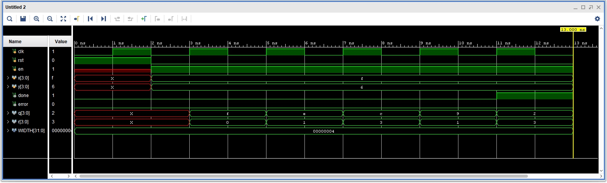

# Lab2 数据通路与状态机

## 1. 排序

### 逻辑设计

采用状态机实现，使用**选择排序**算法。对于数据量较少的排序，选择排序具有较好的时间复杂度。

选择排序中，每趟选择从指定位置开始（`base` 位置）到最后一个数，遍历寻找最小的数（`min` 位置）。一趟遍历完成后，交换 `base` 和 `min` 位置的数，再把 `base` 自加1，直到 base==n-2 时，排序完成。

电路图如下：

<div align="center">

</div>

### 核心代码

```verilog
module SRT #(WIDTH=3) (
    input clk,
    input en,
    input rst,
    input [WIDTH-1:0] x0,
    input [WIDTH-1:0] x1,
    input [WIDTH-1:0] x2,
    input [WIDTH-1:0] x3,
    output done,
    output [WIDTH-1:0] s0,
    output [WIDTH-1:0] s1,
    output [WIDTH-1:0] s2,
    output [WIDTH-1:0] s3
    );

    parameter n=4;

    reg [WIDTH-1:0] s [n-1:0];
    assign s0 = s[0];
    assign s1 = s[1];
    assign s2 = s[2];
    assign s3 = s[3];

    // 使用选择排序

    reg [1:0] base,ptr,min;  // 用于选择排序的三个 index
    reg [2:0] state;

    // 共计4种状态
    parameter init=0,find=1,swap=2,finish=3;

    assign done = state==finish;

    always @(posedge clk or posedge rst) begin
        if (rst) begin
            state=init;
        end
        else if (en) begin

            case (state)
                init: begin     // 初始化
                    s[0]<=x0;
                    s[1]<=x1;
                    s[2]<=x2;
                    s[3]<=x3;
                    base=0;
                    ptr=1;
                    min=0;
                    state=find;
                end
                find: begin     // 找到 base 之后最小的数
                    if (s[ptr]<s[min]) begin
                        min=ptr;
                    end
                    if (ptr==n-1) begin
                        state=swap;
                    end
                    else begin
                        ptr=ptr+1;
                    end
                end
                swap: begin     // 与 base 交换
                    if (min!=base) begin
                        s[min]<=s[base];
                        s[base]<=s[min];
                    end
                    if (base==n-2) begin
                        state=finish;
                    end
                    else begin
                        base=base+1;
                        min=base;
                        ptr=base+1;
                        state=find;
                    end
                end
            endcase

        end

    end

endmodule
```

### 仿真

使用 `$random` 随机生成4个随机数进行测试。

```verilog
`timescale 1ns / 1ps

module SRT_tb;

    parameter WIDTH=4;

    reg clk,rst,en;
    reg [WIDTH-1:0] x [3:0];
    wire [WIDTH-1:0] s [3:0];
    wire done;

    // 生成时钟
    initial begin
        clk=0;
        forever begin
            #1 clk=~clk;
        end
    end

    SRT #(.WIDTH(WIDTH)) DUT(
        .clk(clk), .rst(rst), .en(en),
        .x0(x[0]), .x1(x[1]), .x2(x[2]), .x3(x[3]),
        .done(done),
        .s0(s[0]), .s1(s[1]), .s2(s[2]), .s3(s[3])
        );

    integer i;

    initial begin
        rst=1;
        #2 rst=0;
        en=1;
        // 随机生成4个数
        for (i = 0; i < 4; i = i + 1) begin
            x[i]=$random;
        end
    end

    always @(posedge clk) begin
        if (done) begin
            // 检验排序结果
            if (
                $unsigned(s[0])<=$unsigned(s[1]) &&
                $unsigned(s[1])<=$unsigned(s[2]) &&
                $unsigned(s[2])<=$unsigned(s[3])
                ) begin
                $display("pass");
            end
            else begin
                $display("error");
            end
            $finish;
        end
    end

endmodule
```

测试结果为：

<div align="center">

</div>

波形图为：

<div align="center">

</div>

### 结果分析

由波形图可知，任何4个数在此设计上时，都可以在**9个周期**内排序完成。

但对于较多数据的排序，应该改用快速排序、基数排序等更快的算法实现。

下载照片如下。排序前：

<div align="center">

</div>

排序后：

<div align="center">

</div>

## 2. 除法器


### 逻辑设计

除法器采用移位除法器的设计，此处不赘述，具体见

[https://blog.csdn.net/zqm201/article/details/44978957](https://blog.csdn.net/zqm201/article/details/44978957)

电路图如下：

<div align="center">

</div>

### 核心代码

```verilog
module DIV #(WIDTH=4) (
    input clk,
    input rst,
    input en,
    input [WIDTH-1:0] x,
    input [WIDTH-1:0] y,
    output done,
    output error,
    output [WIDTH-1:0] q,
    output [WIDTH-1:0] r
    );

    reg [WIDTH-1:0] divisor,remainder,quotient;
    wire [WIDTH-1:0] s;
    wire CF;

    // 调用 ALU, 使用 CF 输出判断大于小于
    ALU #(.WIDTH(WIDTH)) alu(
        .sel('b010),
        .a({remainder[WIDTH-2:0],quotient[WIDTH-1]}), .b(divisor),
        .s(s), .CF(CF)
        );

    reg [2:0] state;
    parameter init=0,run=1,finish=2,err=3;

    reg [2:0] step;

    always @(posedge clk or posedge rst) begin
        if (rst) begin
            state=init;
        end
        else if (en) begin
            case (state)
                init: begin     // 初始化
                    if (y==0) begin
                        state=err;
                    end
                    else begin
                        divisor<=y;
                        remainder<=0;
                        quotient<=x;
                        state=run;
                        step=1;
                    end
                end
                run: begin      // 移位，比较，写入
                    if (CF) begin   // 小于
                        remainder[WIDTH-1:1]<=remainder[WIDTH-2:0];
                        remainder[0]<=quotient[WIDTH-1];
                        quotient[0]<=0;
                    end
                    else begin 		// 大于等于
                        remainder<=s;
                        quotient[0]<=1;
                    end
                    quotient[WIDTH-1:1]<=quotient[WIDTH-2:0];

                    if (step==4) begin      // 结束
                        state=finish;
                    end
                    else begin
                        step=step+1;
                    end
                end
            endcase
        end
    end

    assign q = quotient;
    assign r = remainder;
    assign done = state==finish || state==err;
    assign error = state==err;

endmodule
```

### 仿真

使用 `$random` 随机生成2个随机数进行测试。

```verilog
`timescale 1ns / 1ps

module DIV_tb;

    parameter WIDTH=4;

    reg clk,rst,en;
    reg [WIDTH-1:0] x,y;
    wire done,error;
    wire [WIDTH-1:0] q,r;

    DIV #(.WIDTH(WIDTH)) DUT(
        .clk(clk), .rst(rst), .en(en),
        .x(x), .y(y),
        .done(done), .error(error),
        .q(q), .r(r)
        );

    // 产生时钟
    initial begin
        clk=0;
        forever begin
            #1 clk=~clk;
        end
    end

    initial begin
        rst=1;
        #2 rst=0;
        en=1;
        x=15;
        y=6;
    end

    always @(posedge clk) begin
        if (done) begin
            if (
                (y==0 && error) ||
                (q==x/y && r==x%y)
                ) begin
                $display("pass");
            end
            else begin
                $display("error");
            end
            $finish;
        end
    end

endmodule
```

测试结果为：

<div align="center">

</div>

波形图为：

<div align="center">

</div>

### 结果分析

由波形图可知，对于4位除法，此设计都可以在**4个周期**内输出结果。

下载照片如下，展示的是4位除法，15/6：

<div align="center">

</div>