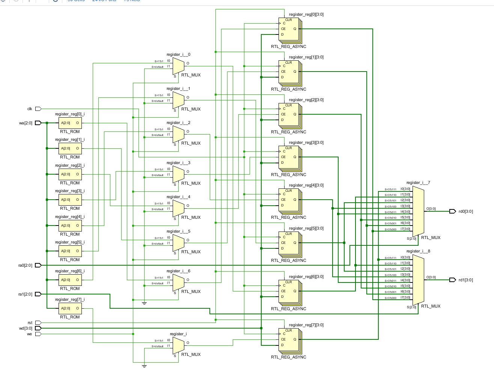
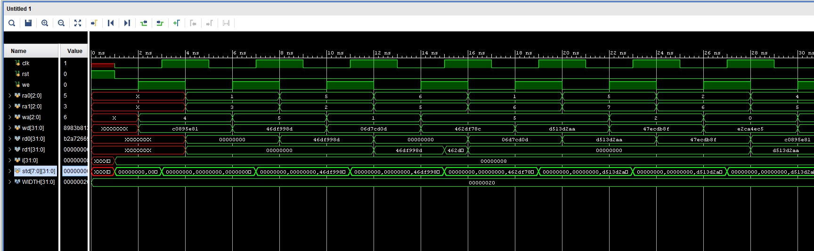
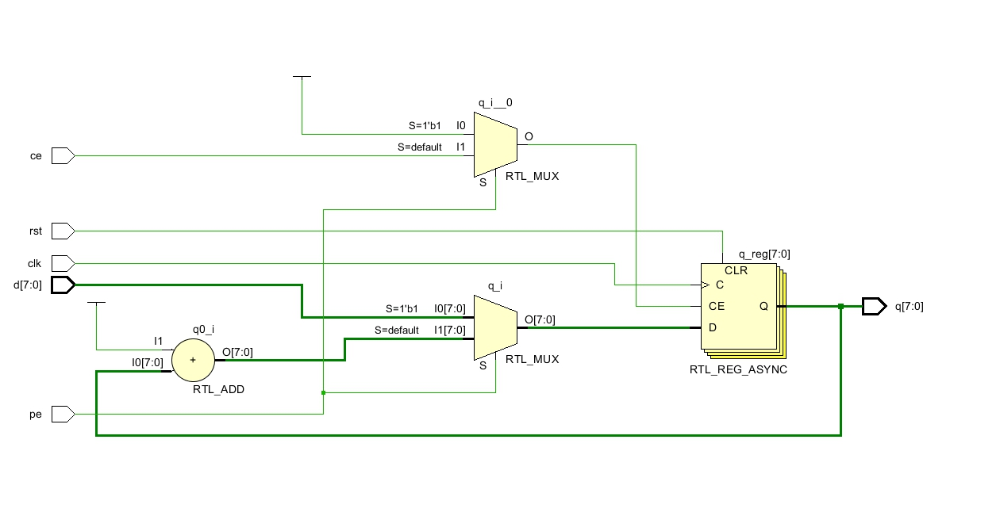
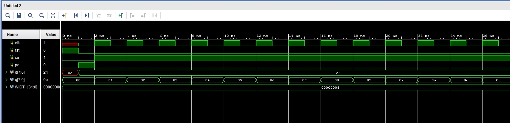
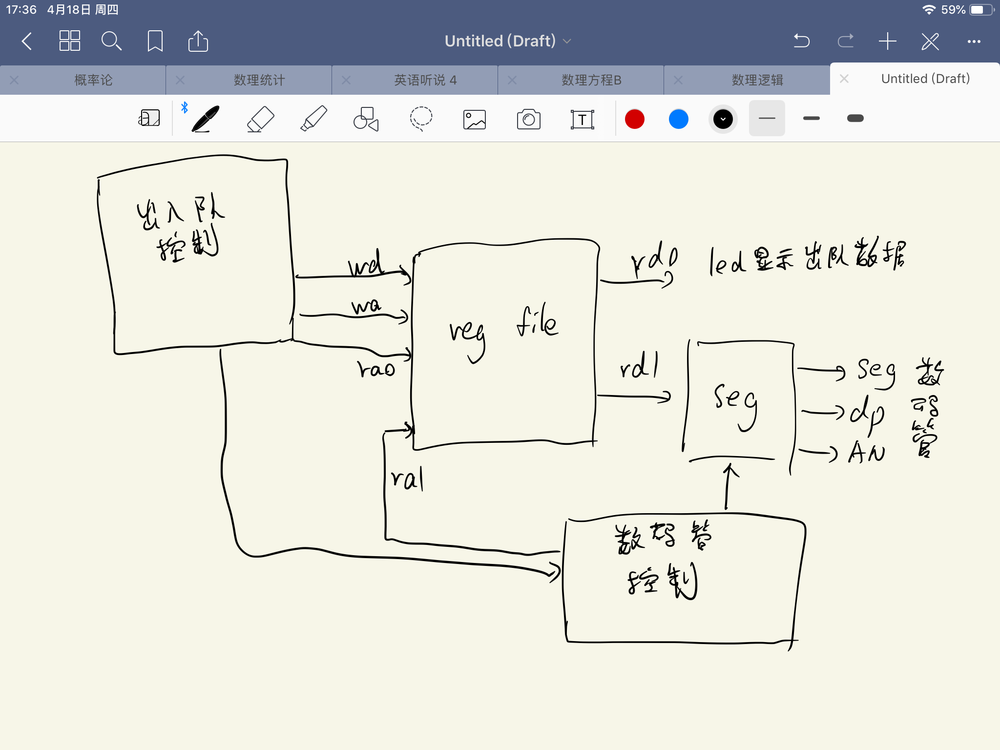
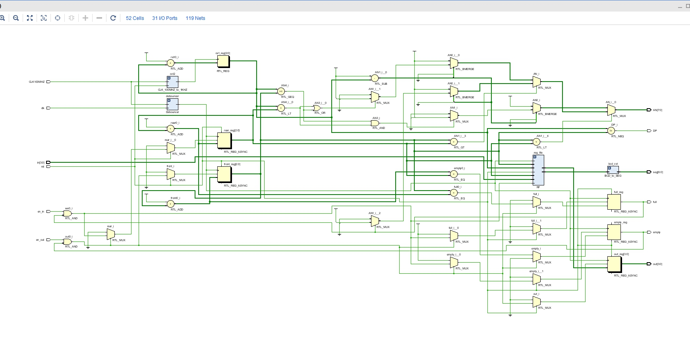
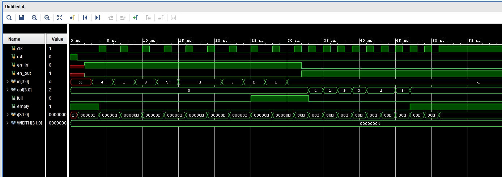

# Lab3 寄存器堆与计数器

## 1. 寄存器堆

### 逻辑设计

寄存器堆通过一个译码器向指定的寄存器传送写入使能信号 `CE`, 使用两个选择器根据 `ra0` 和 `ra1` 在寄存器中选出输出数据 `rd0` 和 `rd1`. 写入是同步的，受 `clk` 和 `we` 控制，而输出是异步的，`ra` 改变后 `rd` 随即改变。

电路图如下：

<div align="center">

</div>

### 核心代码

```verilog
module RF #(parameter WIDTH=4) (
    input clk,
    input rst,
    input we,
    input [2:0] ra0,
    input [2:0] ra1,
    input [2:0] wa,
    input [WIDTH-1:0] wd,
    output [WIDTH-1:0] rd0,
    output [WIDTH-1:0] rd1
    );
    reg [WIDTH-1:0] register [7:0];

    assign rd0 = register[ra0];
    assign rd1 = register[ra1];

    integer i;

    always @(posedge clk or posedge rst) begin
        if (rst) begin
            // 重置
            for (i = 0; i < 8; i = i + 1) begin
                register[i]<=0;
            end
        end
        else if (we) begin
            // 写入
            register[wa]<=wd;
        end
    end
endmodule
```

### 仿真

仿真代码使用 `reg` 实现一个标准参考寄存器堆。每次在被测试寄存器堆随机位置写入一个随机数，再在随机位置读取所存的数，与参考寄存器进行比较。若一致，则表示设计正确。

仿真代码如下：

```verilog
`timescale 1ns / 1ps

module RF_tb;

    parameter WIDTH=32;

    reg clk,rst,we;
    reg [2:0] ra0,ra1,wa;
    reg [WIDTH-1:0] wd;
    wire [WIDTH-1:0] rd0,rd1;

    RF #(.WIDTH(WIDTH)) regfile(
        .clk(clk), .rst(rst), .we(we),
        .ra0(ra0), .ra1(ra1), .wa(wa),
        .wd(wd), .rd0(rd0), .rd1(rd1)
        );

    integer i;

    reg [WIDTH-1:0] std [7:0];

    initial begin
        we=0;
        rst=1;
        #1 rst=0;
        for (i = 0; i < 8; i = i + 1) begin
            std[i]=0;
        end
        forever begin
            clk=0;
            #1 we=1;
            // 在随机位置写入
            wa=$random % 8;
            wd=$random;
            #1 clk=1;
            std[wa]=wd;
            #1 we=0;
            // 随机读取两个数
            ra0=$random % 8;
            ra1=$random % 8;
            #1;
            // 读取并检验
            if (rd0!=std[ra0] || rd1!=std[ra1]) begin
                $display("error");
                $finish;
            end
        end
    end

endmodule
```

设计模块已通过以上 testbench 测试。

波形图如下：

<div align="center">

</div>

### 结果分析

下载到开发板后的示例照片如下：

<div align="center">

</div>

## 2. 计数器

### 逻辑设计

计数器的结构较为简单，在此不赘述其原理。

实现电路图如下：

<div align="center">

</div>

### 核心代码

```verilog
module CNT #(parameter WIDTH=8) (
    input clk,
    input rst,
    input ce,
    input pe,
    input [WIDTH-1:0] d,
    output reg [WIDTH-1:0] q
    );

    always @(posedge clk or posedge rst) begin
        if (rst) begin
            q<=0;
        end
        else if (pe) begin
            q<=d;
        end
        else if (ce) begin
            q<=q+1;
        end
    end

endmodule
```

### 仿真

仿真仅做波形图输出。

仿真代码如下：

```verilog
`timescale 1ns / 1ps

module CNT_tb;

    parameter WIDTH=8;

    reg clk,rst,ce,pe;
    reg [WIDTH-1:0] d;
    wire [WIDTH-1:0] q;

    CNT #(.WIDTH(WIDTH)) cnt(
        .clk(clk), .rst(rst),
        .ce(ce), .pe(pe), .d(d), .q(q)
        );

    initial begin
        ce=0;
        pe=0;
        rst=1;
        #1 rst=0;
        clk=0;
        pe=1;   // 置数
        d=$random;
        #1 clk=1;
        pe=0;
        ce=1;
        forever begin
            #1 clk=~clk;
        end
    end

endmodule
```

波形图如下：

<div align="center">

</div>

### 结果分析

下载到开发板的示例照片如下：

<div align="center">

</div>

## FIFO

### 逻辑设计

设计草图如下所示：

<div align="center">

</div>

寄存器堆用于储存队列中的数，一个输出端口 `rd0` 用于指示出队数据显示到 led, `rd1` 用于输出数据显示到数码管。两者独立控制。

电路图如下：

<div align="center">

</div>

### 核心代码

```verilog
// 去抖动
module Debouncer(
    input clk_in,
    input CLK100MHZ,
    output reg clk_out
    );

    reg [2:0] state;

    reg [31:0] cnt;

    parameter waiting=0,counting=1;

    always @(posedge CLK100MHZ) begin
        case (state)
            waiting: begin
                if (clk_in!=clk_out) begin
                    state=counting;
                    cnt=0;
                end
            end
            counting: begin
                if (cnt==10000000) begin
                    if (clk_in!=clk_out) begin
                        clk_out=clk_in;
                    end
                    state=waiting;
                end
                else begin
                    cnt=cnt+1;
                end
            end
        endcase
    end

endmodule


module CLK_100MHZ_to_1KHZ(
    input rst,
    input CLK100MHZ,
    output reg CLK1KHZ
    );

    reg [31:0] cnt;

    always @(posedge CLK100MHZ or posedge rst) begin
        if (rst) begin
            cnt=0;
            CLK1KHZ=0;
        end
        else begin
            if (cnt==50000) begin
                cnt=0;
                CLK1KHZ=~CLK1KHZ;
            end
            else begin
                cnt=cnt+1;
            end
        end
    end

endmodule

// BCD 转数码管显示
module BCD_to_SEG(
    input [3:0] bcd,
    output reg [6:0] seg
    );

    always @(*) begin
        case (bcd)
            'h0: seg='b1000000;
            'h1: seg='b1111001;
            'h2: seg='b0100100;
            'h3: seg='b0110000;
            'h4: seg='b0011001;
            'h5: seg='b0010010;
            'h6: seg='b0000010;
            'h7: seg='b1111000;
            'h8: seg='b0000000;
            'h9: seg='b0010000;
            'hA: seg='b0001000;
            'hB: seg='b0000011;
            'hC: seg='b1000110;
            'hD: seg='b0100001;
            'hE: seg='b0000110;
            'hF: seg='b0001110;
        endcase
    end

endmodule


module FIFO #(parameter WIDTH=4) (
    input clk,
    input rst,
    input en_in,
    input en_out,
    input [WIDTH-1:0] in,
    output reg [WIDTH-1:0] out,
    output reg full,
    output reg empty,

    // 数码管
    input CLK100MHZ,
    output [6:0] seg,
    output DP,
    output reg [7:0] AN
    );

    wire clk_in;

    // assign clk_in = clk;

    Debouncer debouncer(
        .clk_in(clk),
        .CLK100MHZ(CLK100MHZ),
        .clk_out(clk_in)
        );

    reg [2:0] front,rear;

    initial begin
        front<=0;
        rear<=0;
        full<=0;
        empty<=1;
    end

    reg [2:0] ra1;  // 用于数码管显示
    wire [WIDTH-1:0] rd0,rd1;

    RF #(.WIDTH(WIDTH)) reg_file(
        .clk(clk_in), .rst(rst),
        .we(en_in & ~full),
        .wa(rear), .wd(in),
        .ra0(front), .rd0(rd0),
        .ra1(ra1), .rd1(rd1)
        );

    always @(posedge clk_in or posedge rst) begin
        if (rst) begin
            out<=0;
            front<=0;
            rear<=0;
            full<=0;
            empty<=1;
        end
        else begin
            if (en_out & ~empty) begin
                front=front+1;
                out=rd0;
                full=0;
                empty= front==rear;
            end
            else if (en_in & ~full) begin
                rear=rear+1;
                full= front==rear;
                empty=0;
            end
        end
    end

    wire CLK1KHZ;

    CLK_100MHZ_to_1KHZ cvt2(
        .rst(rst),
        .CLK100MHZ(CLK100MHZ),
        .CLK1KHZ(CLK1KHZ)
        );

    BCD_to_SEG bcd_cvt(
        .bcd(rd1),
        .seg(seg)
        );

    always @(posedge CLK1KHZ) begin
        ra1<=ra1+1;
    end

    assign DP = ra1!=front;

    parameter on=0,off=1;

    always @(*) begin
        AN='b11111111;
        if (front<rear) begin
            AN[7-ra1]= (ra1>=front && ra1<rear) ? on : off;
        end
        else if(front>rear) begin
            AN[7-ra1]= (ra1<rear || ra1>=front) ? on : off;
        end
        else begin
            AN[7-ra1]= full ? on : off;
        end
    end

endmodule
```

### 仿真

队列容量为 8，在仿真时先入队 10 个数，再全部出队，看输出波形是否符合预期。

仿真代码如下：

```verilog
`timescale 1ns / 1ps

module FIFO_tb;

    parameter WIDTH=4;

    reg clk,rst,en_in,en_out;
    reg [WIDTH-1:0] in;
    wire [WIDTH-1:0] out;
    wire full,empty;

    FIFO #(.WIDTH(WIDTH)) fifo(
        .clk(clk), .rst(rst), .en_in(en_in), .en_out(en_out),
        .in(in), .out(out), .full(full), .empty(empty)
        );

    integer i;

    initial begin
        clk=0;
        rst=1;
        #1 rst=0;

        // 入队列
        for (i = 0; i < 10; i = i + 1) begin
            #1 clk=0;
            en_in=1;
            en_out=0;
            #1 in=$random;
            #1 clk=1;
        end

        // 出队列
        for (i = 0; i < 10; i = i + 1) begin
            #1 clk=0;
            en_in=0;
            en_out=1;
            #1 clk=1;
        end
    end

endmodule
```

输出波形图如下：

<div align="center">

</div>

符合预期。

### 实验总结

下载到开发板的示例照片如下：

<div align="center">

</div>
