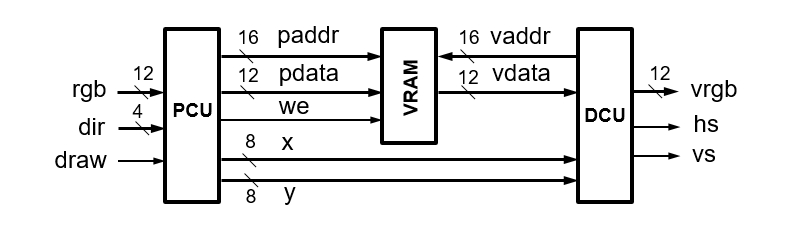
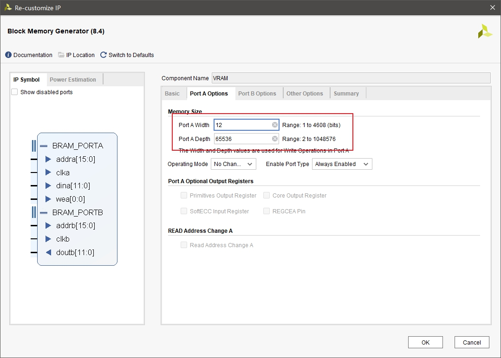
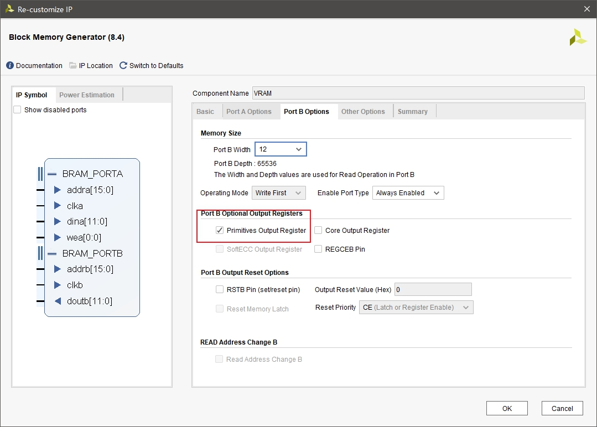
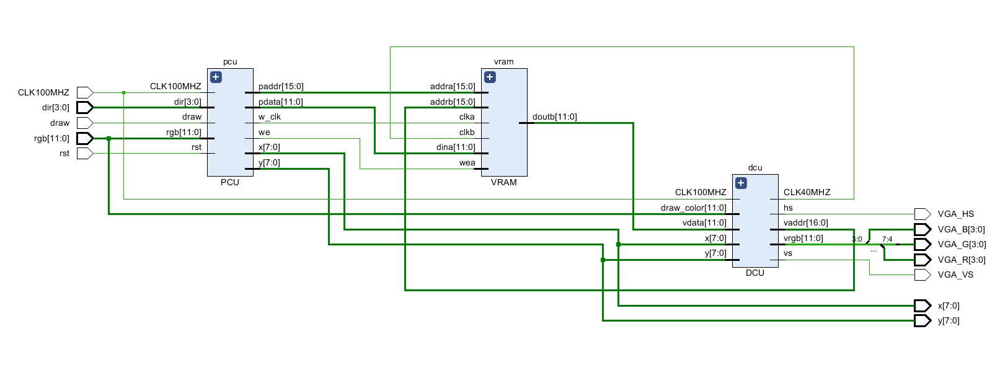

# Lab4 存储器与显示控制器

## 逻辑设计

<div align="center">

</div>

VRAM 储存 256x256 屏幕的像素点颜色信息，有独立的输入端口和输出端口，输入端口和 PCU 连接，输出端口和 DCU 连接。

PCU 和按钮连接，负责控制当前笔画所在位置和颜色，输出当前位置 x,y 到 DCU 以控制十字的绘画。

PCU 内部每 0.1s 检测上下左右按钮是否被按下，并更改相应的 x,y, 以此实现按下按钮时笔画连续移动。

PCU 是个状态机，有两种状态：绘画模式和重置模式。

当正常绘画时处于绘画模式。

当按下 rst 时，PCU 进入重置模式，把 VRAM 的数据全部置为初始值，然后自动回到绘画模式。

DCU 负责产生 VGA 接口的 sync 信号，传送 RGB 数据给显示器，并在合适的地方绘画十字。

## 核心代码

PCU 采用 IP 核 Block Memory 实现，设置为同步读写（同步读可以消除 DCU 读取频率过高导致的彩虹纹问题），65536 个 12 bit RGB 数据容量，如下图：

<div align="center">

</div>

<div align="center">

</div>

PCU 采用“逻辑设计”中所说的设计，绘画模式时写 VRAM 的频率为 100Hz，重置模式时是 100MHz. 代码如下：

```verilog
`timescale 1ns / 1ps

// 生成 100Hz 时钟
module clk_100MHZ_to_100HZ(
    input CLK100MHZ,
    input rst,
    output reg CLK100HZ
    );

    reg [31:0] cnt;

    always @(posedge CLK100MHZ or posedge rst) begin
        if (rst) begin
            cnt=0;
            CLK100HZ=0;
        end
        else begin
            if (cnt==500000) begin
                cnt=0;
                CLK100HZ=~CLK100HZ;
            end
            else begin
                cnt=cnt+1;
            end
        end
    end  

endmodule


// 生成 10 Hz 时钟
module clk_100MHZ_to_10HZ(
    input CLK100MHZ,
    input rst,
    output reg CLK10HZ
    );

    reg [31:0] cnt;

    always @(posedge CLK100MHZ or posedge rst) begin
        if (rst) begin
            cnt=0;
            CLK10HZ=0;
        end
        else begin
            if (cnt==5000000) begin
                cnt=0;
                CLK10HZ=~CLK10HZ;
            end
            else begin
                cnt=cnt+1;
            end
        end
    end  

endmodule


module PCU(
    input CLK100MHZ,
    input rst,
    input [11:0] rgb,
    input [3:0] dir,
    input draw,
    output reg [7:0] x,
    output reg [7:0] y,
    output [15:0] paddr,
    output [11:0] pdata,
    output we,
    output w_clk
    );

    wire CLK100HZ,CLK10HZ;

    clk_100MHZ_to_100HZ clk_cvt2(
        .CLK100MHZ(CLK100MHZ),
        .CLK100HZ(CLK100HZ),
        .rst(rst)
        );

    clk_100MHZ_to_10HZ clk_cvt3(
        .CLK100MHZ(CLK100MHZ),
        .CLK10HZ(CLK10HZ),
        .rst(rst)
        );

    // 状态
    reg state;
    parameter drawing=0, reseting=1;

    reg [15:0] rst_paddr;

    assign paddr = state==drawing ? {x,y} : rst_paddr;
    assign pdata = state==drawing ? rgb : 0;
    assign we = state==drawing ? draw : 1;
    assign w_clk = state==drawing ? CLK100HZ : CLK100MHZ;

    // 重置时使用
    always @(posedge CLK100MHZ or posedge rst) begin
        if (rst) begin
            state=reseting;
            rst_paddr=0;
        end
        else if (state==reseting) begin
            if (rst_paddr=='hFFFF) begin
                state=drawing;
            end
            else begin
                rst_paddr=rst_paddr+1;
            end
        end
    end

    // up 为 dir[0], 顺时针顺序排列
    always @(posedge CLK10HZ or posedge rst) begin
        if (rst) begin
            x=128;
            y=128;
        end
        else if (state==drawing) begin
            if (dir[0] && ~dir[2] && y>=1) begin
                y=y-1;
            end
            else if (~dir[0] && dir[2] && y<=254) begin
                y=y+1;
            end
            if (dir[1] && ~dir[3] && x<=254) begin
                x=x+1;
            end
            else if (~dir[1] && dir[3] && x>=1) begin
                x=x-1;
            end
        end
    end

endmodule
```

DCU 适配 800x600 @60Hz 的显示器，并在十字的地方做反色处理，以凸显十字，代码如下：

```verilog
`timescale 1ns / 1ps

module DCU(
    input CLK100MHZ,
    input [7:0] x,
    input [7:0] y,
    input [11:0] draw_color,
    input [11:0] vdata,
    output [16:0] vaddr,
    output [11:0] vrgb,
    output hs,
    output vs,
    output CLK40MHZ
    );

    clk_100MHZ_to_40MHZ clk_cvt(
        .CLK100MHZ(CLK100MHZ),
        .CLK40MHZ(CLK40MHZ)
        );

    //注意坑，前面是Back后面是Front

    // 800x600 @ 60Hz
    parameter HSync=128;
    parameter HBackPorch=88;
    parameter HActive=800;
    parameter HFrontPorch=40;

    parameter VSync=4;
    parameter VBackPorch=23;
    parameter VActive=600;
    parameter VFrontPorch=1;

    reg [31:0] V_count,H_count;     //刷新信号的行数与列数

    always @(posedge CLK40MHZ) begin
        if(H_count==HSync+HBackPorch+HActive+HFrontPorch-1) begin
            H_count=0;
            if(V_count==VSync+VBackPorch+VActive+VFrontPorch-1) begin
                V_count=0;
            end
            else begin
                V_count=V_count+1;
            end
        end
        else begin
            H_count=H_count+1;
        end
    end

    // sync 信号
    assign hs = H_count < HSync;
    assign vs = V_count < VSync;

    wire signed [31:0] raw,col; //显示区域的行数与列数

    assign col = H_count-HSync-HBackPorch-(HActive-256)/2;
    assign raw = V_count-VSync-VBackPorch-(VActive-256)/2;

    wire de;        // 256x256 的显示区域
    assign de = (raw>=0 && raw<256 && col>=0 && col<256);

    wire on_cross;
    assign on_cross =
        (raw==y && (col+10)>=x && (col-10)<=x) ||
        (col==x && (raw+10)>=y && (raw-10)<=y);

    assign vrgb = de ? ( on_cross ? ~vdata : vdata ) : 0;

    // 同步读取 col 的值要 +1
    assign vaddr = {col[7:0]+1,raw[7:0]};

endmodule
```

以上模块组合为 top 模块，代码如下

```verilog
`timescale 1ns / 1ps

module top(
    input CLK100MHZ,
    input [11:0] rgb,
    input [3:0] dir,
    input draw,
    input rst,
    output [3:0] VGA_R,
    output [3:0] VGA_G,
    output [3:0] VGA_B,
    output VGA_HS,
    output VGA_VS,
    output [7:0] x,
    output [7:0] y
    );

    wire [15:0] vaddr,paddr;
    wire [11:0] vdata,pdata;
    wire CLK40MHZ;

    DCU dcu(
        .CLK100MHZ(CLK100MHZ),
        .x(x),
        .y(y),
        .draw_color(rgb),
        .vdata(vdata),
        .vaddr(vaddr),
        .vrgb({VGA_R,VGA_G,VGA_B}),
        .hs(VGA_HS),
        .vs(VGA_VS),
        .CLK40MHZ(CLK40MHZ)
        );

    wire w_clk;
    wire we;

    VRAM vram(
        .addra(paddr),
        .clka(w_clk),
        .dina(pdata),
        .wea(we),
        .addrb(vaddr),
        .clkb(CLK40MHZ),
        .doutb(vdata)
        );

    PCU pcu(
        .CLK100MHZ(CLK100MHZ),
        .rst(rst),
        .x(x),
        .y(y),
        .paddr(paddr),
        .pdata(pdata),
        .we(we),
        .rgb(rgb),
        .dir(dir),
        .draw(draw),
        .w_clk(w_clk)
        );

endmodule
```

以上代码 Schematic 产生的电路图如下：

<div align="center">

</div>

## 结果分析

下载结果如下所示：

<div align="center">

</div>

## 实验总结

本次实验着重于练习储存器的使用和 VGA 接口的时序逻辑，其中对于储存器的使用党法可用于以后的 CPU 实现。
