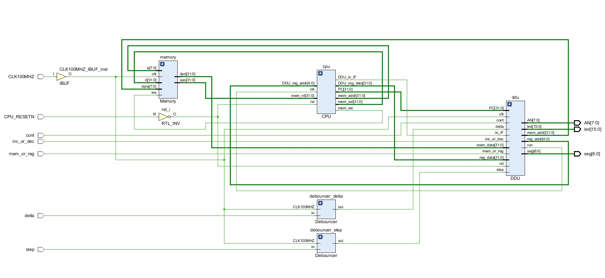

# Lab5 多周期 MIPS CPU

## 逻辑设计

本实验设计的 MIPS 是多周期的，共支持以下种类的指令：

- 访存类：`lw`, `sw`

- R-R 运算类：`add`, `sub`, `slt`, `sltu`, `sll`, `srl`, `sra`, `sllv`, `srlv`, `srav`, `and`, `or`, `xor`, `nor`

- R-I 运算：`addi`, `andi`, `ori`, `xori`, `slti`, `sltiu`

- 跳转指令：`j`, `jal`, `jr`, `jalr`

- 分支指令：`beq`, `bne`, `blez`, `bgtz`, `bltz`, `bgez`

所设计的状态机的状态转换图如下：

<div align="center">

</div>

根据以上状态机所设计的控制器一共会控制以下几个信号：

- PCSrc: 从 ALU 结果、寄存器和立即数中选择新的 PC 来源

- PXWrite: 写 PC 的控制信号

- MASrc: 内存地址选择，从 ALU 结果和 PC 之间选择

- MemWrite: 内存写信号

- IRWrite: 把读出的内存数据写入到 IR

- MDRWrite: 把读出的内存数据写入到 MDR

- RegWASrc: 寄存器写地址选择，包括 rd, rt 和 31 （JAL 和 JALR 指令需要）

- RegWDSrc: 选择写入寄存器的数据来源，包括 ALU 结果，MDR 和 PC

- ALUSrcA: 选择 ALU 第一个操作数，包括 rs, PC, 移位立即数（用于 `sll`, `srl`, `sra` 指令）

- ALUSrcB: 选择 ALU 第二个操作数，包括 rt, sext(imm16)（访存指令）, sext(imm16)<<2（分支指令）, zext(imm16)（`andi`, `ori`, `xori`）, 4（PC+4）, 0（`blez`, `bgtz`, `bltz`, `bgez`）

根据上述方法设计出的 CPU 电路图如下：

<div align="center">

</div>

RAM 部分使用 IP 核 Distribute Mmemory 例化实现，并采用双口模式，一口连接 CPU，一口连接 DDU 以供调试读取数据。

DDU 中单步执行的实现方式是：

- 未按下时处于 suspending 状态，不向 CPU 输出波形，此时 CPU 处于 IF 状态

- 按下按钮，转化到 running 状态，向 CPU 输出波形，当 CPU 再次处于 IF 时，转入 waiting 状态

- 松开按钮时，回到 suspending 状态

整体实现的电路图如下：

<div align="center">

</div>

## 核心代码

### 寄存器文件

```verilog
module Registers(
    input clk,
    input rst,
    input re,
    input we,
    input [4:0] ra1,
    input [4:0] ra2,
    input [4:0] ra3,
    input [4:0] wa,
    input [31:0] wd,
    output reg [31:0] rd1,
    output reg [31:0] rd2,
    output [31:0] rd3
    );

    reg [31:0] store [31:1];

    // rd3 输出到 DDU
    assign rd3 = store[ra3];

    integer i;
    always @(posedge clk or posedge rst) begin
        if(rst) begin
            for (i = 1; i < 32; i = i + 1) begin
                store[i] <= 0;
            end
            rd1 <= 0;
            rd2 <= 0;
        end
        else begin
            if(we) begin
                store[wa] <= wd;
            end
            if(re) begin
                // 采用同步读
                rd1 <= store[ra1];
                rd2 <= store[ra2];
            end
        end
    end

endmodule
```

### ALU

```verilog
module ALU (
    input signed [31:0] A,
    input signed [31:0] B,
    output reg signed [31:0] S,
    input [3:0] op,
    output [2:0] nzp
    );

    wire unsigned [31:0] Au,Bu;
    assign Au=$unsigned(A);
    assign Bu=$unsigned(B);

    wire [4:0] shift;
    assign shift=A[4:0];

    // ALU op 码
    parameter
        ALU_OP_ADD=1,
        ALU_OP_SUB=2,
        ALU_OP_SLT=5,
        ALU_OP_SLTU=6,
        ALU_OP_SLL=7,
        ALU_OP_SRL=8,
        ALU_OP_SRA=9,
        ALU_OP_AND=10,
        ALU_OP_OR=11,
        ALU_OP_XOR=12,
        ALU_OP_NOR=13;

    always @(*) begin
        case (op)
            ALU_OP_ADD: S = A + B;
            ALU_OP_SUB: S = A - B;
            ALU_OP_SLT: S = A < B ? 1 : 0;
            ALU_OP_SLTU: S = Au < Bu ? 1 : 0;
            ALU_OP_SLL: S = B << shift;
            ALU_OP_SRL: S = B >> shift;
            ALU_OP_SRA: S = B >>> shift;
            ALU_OP_AND: S = A & B;
            ALU_OP_OR: S = A | B;
            ALU_OP_XOR: S = A ^ B;
            ALU_OP_NOR: S = ~(A | B);
            default: S=0;
        endcase
    end

    // 用于跳转指令，判断跳转是否成功
    assign nzp = { S<0, S==0, S>0 };

endmodule
```

### 控制器

```verilog
module Control (
    input clk,
    input rst,
    input [31:0] inst,
    input [2:0] nzp,    // 用于分支

    // PC 相关
    output reg [1:0] PCSrc,
    output PCWrite,

    // Mem 相关
    output MASrc,
    output MemWrite,
    output IRWrite,
    output MDRWrite,

    // reg 相关
    output reg [1:0] RegWASrc,
    output RegRead,
    output RegWrite,
    output reg [1:0] RegWDSrc,

    // ALU 相关
    output reg [1:0] ALUSrcA,
    output reg [2:0] ALUSrcB,
    output reg [3:0] ALUOp,
    output ALUOutWrite,
    // output NZPWrite,

    // DDU
    output DDU_in_IF
    );

    assign DDU_in_IF = state==IF;

    wire [5:0] op,funct;
    wire [4:0] spec;

    assign op = inst[31:26];
    assign funct = inst[5:0];
    assign spec = inst[20:16];

    parameter
        OP_LW='h23,
        OP_SW='h2B,

        OP_R='h0,

        OP_ADDI='h8,
        OP_ANDI='hC,
        OP_ORI='hD,
        OP_XORI='hE,
        OP_SLTI='hA,
        OP_SLTIU='hB,

        OP_BEQ='h4,
        OP_BNE='h5,
        OP_BLEZ='h6,
        OP_BGTZ='h7,

        OP_BLTZ_BGEZ='h1,
        SPEC_BLTZ='h0,
        SPEC_BGEZ='h1,

        OP_J='h2,
        OP_JAL='h3,
        OP_JR_JALR='h0,
        FUNCT_JR='h8,
        FUNCT_JALR='h9,

        FUNCT_ADD='h20,
        FUNCT_SUB='h22,
        FUNCT_SLT='h2A,
        FUNCT_SLTU='h2B,
        FUNCT_SLL='h0,
        FUNCT_SRL='h2,
        FUNCT_SRA='h3,
        FUNCT_SLLV='h4,
        FUNCT_SRLV='h6,
        FUNCT_SRAV='h7,
        FUNCT_AND='h24,
        FUNCT_OR='h25,
        FUNCT_XOR='h26,
        FUNCT_NOR='h27;

    reg [4:0] state;

    parameter
        IF=1,       // inst fetch
        ID=2,       // inst decode

        R_R=3,      // R_R inst ALU
        R_I=4,      // R_I inst ALU
        R_R_WB=5,
        R_I_WB=6,

        J=7,
        JR=8,
        JAL=9,
        JALR=10,

        B=11,
        BZ=12,
        B_PC=13,

        LW_SW=14,
        MEM_READ=15,
        MEM_WRITE=16,
        LW_WB=17,
        ERROR=0;

    // 状态转换
    always @(posedge clk or posedge rst) begin
        if(rst) begin
            state <= IF;
        end
        else begin
            case (state)
                IF: state <= ID;
                ID: begin
                    // 根据 op 和 funct 更改
                    case (op)
                        OP_LW: state <= LW_SW;
                        OP_SW: state <= LW_SW;
                        OP_R: state <= R_R;
                        OP_ADDI: state <= R_I;
                        OP_ANDI: state <= R_I;
                        OP_ORI: state <= R_I;
                        OP_XORI: state <= R_I;
                        OP_SLTI: state <= R_I;
                        OP_SLTIU: state <= R_I;
                        OP_BEQ: state <= B;
                        OP_BNE: state <= B;
                        OP_BLEZ: state <= BZ;
                        OP_BGTZ: state <= BZ;
                        OP_BLTZ_BGEZ: state <= BZ;
                        OP_J: state <= J;
                        OP_JAL: state <= JAL;
                        OP_JR_JALR: begin
                            case (funct)
                                FUNCT_JR: state <= JR;
                                FUNCT_JALR: state <= JALR;
                                default: state <= ERROR;
                            endcase
                        end
                        default: state <= ERROR;
                    endcase
                end
                R_R: state <= R_R_WB;
                R_I: state <= R_I_WB;
                R_R_WB: state <= IF;
                R_I_WB: state <= IF;
                J: state <= IF;
                JR: state <= IF;
                JAL: state <= IF;
                JALR: state <= IF;
                B: begin
                    // 根据判断结果
                    case (op)
                        OP_BEQ: state <= nzp[1] ? B_PC : IF;
                        OP_BNE: state <= (nzp[2]|nzp[0]) ? B_PC : IF;
                        default: state <= ERROR;
                    endcase
                end
                BZ: begin
                    // 根据判断结果
                    case (op)
                        OP_BLEZ: state <= (nzp[2]|nzp[1]) ? B_PC : IF;
                        OP_BGTZ: state <= nzp[0] ? B_PC : IF;
                        OP_BLTZ_BGEZ: begin
                            case (spec)
                                SPEC_BLTZ: state <= nzp[2] ? B_PC : IF;
                                SPEC_BGEZ: state <= (nzp[1]|nzp[0]) ? B_PC : IF;
                                default: state <= ERROR;
                            endcase
                        end
                        default: state <= ERROR;
                    endcase
                end
                B_PC: state <= IF;
                LW_SW: begin
                    // 根据 op 判断
                    case (op)
                        OP_LW: state <= MEM_READ;
                        OP_SW: state <= MEM_WRITE;
                        default: state <= ERROR;
                    endcase
                end
                MEM_READ: state <= LW_WB;
                MEM_WRITE: state <= IF;
                LW_WB: state <= IF;
                default: state <= ERROR;
            endcase
        end
    end

    assign PCWrite = |{ state==IF, state==J, state==JR, state==JAL, state==JALR, state==B_PC};
    // PCSrc:
    // 0: S  1: rs  2: J_imm
    always @(*) begin
        case (state)
            IF: PCSrc = 0;
            B_PC: PCSrc = 0;
            J: PCSrc = 2;
            JR: PCSrc = 1;
            JAL: PCSrc = 2;
            JALR: PCSrc = 1;
            default: PCSrc = 0;
        endcase
    end

    // MASrc:
    // 0: PC  1: ALU
    assign MASrc = state==MEM_READ || state==MEM_WRITE;
    assign MemWrite = state==MEM_WRITE;
    assign IRWrite = state==IF;
    assign MDRWrite = state==MEM_READ;

    assign RegRead = state==ID;
    assign RegWrite = |{state==LW_WB, state==R_R_WB, state==R_I_WB, state==JAL, state==JALR};
    // RegWASrc:
    // 0: rd  1: rt  2:31
    always @(*) begin
        case (state)
            R_R_WB: RegWASrc = 0;
            R_I_WB: RegWASrc =1;
            LW_WB: RegWASrc = 1;
            JAL: RegWASrc = 2;
            JALR: RegWASrc = 0;
            default: RegWASrc = 0;
        endcase
    end
    // RegWDSrc:
    // 0: ALU  1: MDR  2: PC
    always @(*) begin
        case (state)
            R_R_WB: RegWDSrc = 0;
            R_I_WB: RegWDSrc = 0;
            LW_WB: RegWDSrc = 1;
            JAL: RegWDSrc =2;
            JALR: RegWDSrc =2;
            default: RegWDSrc = 0;
        endcase
    end

    // ALUSrcA
    // 0: rs  1:PC  2:shift
    always @(*) begin
        case (state)
            IF: ALUSrcA = 1;
            // 移位指令特殊处理
            R_R: ALUSrcA = |{funct==FUNCT_SLL, funct==FUNCT_SRL, funct==FUNCT_SRA} ? 2 : 0;
            R_I: ALUSrcA = 0;
            B: ALUSrcA = 0;
            BZ: ALUSrcA = 0;
            B_PC: ALUSrcA = 1;
            LW_SW: ALUSrcA = 0;
            default: ALUSrcA = 0;
        endcase
    end

    // ALUSrcB
    // 0:rt  1: sext(imm16)  2: sext(imm16)<<2
    // 3:zext(imm16)  4:4  5:0
    always @(*) begin
        case (state)
            IF: ALUSrcB = 4;
            R_R: ALUSrcB = 0;
            // ANDI ORI XORI 需要 zimm
            R_I: ALUSrcB = |{op==OP_ANDI, op==OP_ORI, op==OP_XORI} ? 3 : 1;
            B: ALUSrcB = 0;
            BZ: ALUSrcB = 5;
            B_PC: ALUSrcB = 2;
            LW_SW: ALUSrcB = 1;
            default: ALUSrcB = 0;
        endcase
    end

    assign ALUOutWrite = |{state==R_R, state==R_I, state==LW_SW};
    // assign NZPWrite = state==B || state==BZ;

    // ALU op 码
    parameter
        ALU_OP_ADD=1,
        ALU_OP_SUB=2,
        ALU_OP_SLT=5,
        ALU_OP_SLTU=6,
        ALU_OP_SLL=7,
        ALU_OP_SRL=8,
        ALU_OP_SRA=9,
        ALU_OP_AND=10,
        ALU_OP_OR=11,
        ALU_OP_XOR=12,
        ALU_OP_NOR=13;

    // ALUOp
    always @(*) begin
        case (state)
            IF: ALUOp = ALU_OP_ADD;
            R_R: begin
                case (funct)
                    FUNCT_ADD: ALUOp = ALU_OP_ADD;
                    FUNCT_SUB: ALUOp = ALU_OP_SUB;
                    FUNCT_SLT: ALUOp = ALU_OP_SLT;
                    FUNCT_SLTU: ALUOp = ALU_OP_SLTU;
                    FUNCT_SLL: ALUOp = ALU_OP_SLL;
                    FUNCT_SRL: ALUOp = ALU_OP_SRL;
                    FUNCT_SRA: ALUOp = ALU_OP_SRA;
                    FUNCT_SLLV: ALUOp = ALU_OP_SLL;
                    FUNCT_SRLV: ALUOp = ALU_OP_SRL;
                    FUNCT_SRAV: ALUOp = ALU_OP_SRA;
                    FUNCT_AND: ALUOp = ALU_OP_AND;
                    FUNCT_OR: ALUOp = ALU_OP_OR;
                    FUNCT_XOR: ALUOp = ALU_OP_XOR;
                    FUNCT_NOR: ALUOp = ALU_OP_NOR;
                    default : ALUOp = 0;
                endcase
            end
            R_I: begin
                case (op)
                    OP_ADDI: ALUOp = ALU_OP_ADD;
                    OP_ANDI: ALUOp = ALU_OP_AND;
                    OP_ORI: ALUOp = ALU_OP_OR;
                    OP_XORI: ALUOp = ALU_OP_XOR;
                    OP_SLTI: ALUOp = ALU_OP_SLT;
                    OP_SLTIU: ALUOp = ALU_OP_SLTU;
                    default: ALUOp = 0;
                endcase
            end
            B: ALUOp = ALU_OP_SUB; 
            BZ: ALUOp = ALU_OP_SUB;
            B_PC: ALUOp = ALU_OP_ADD;
            LW_SW: ALUOp = ALU_OP_ADD;
            default: ALUOp = 0;
        endcase
    end

endmodule
```

### CPU 整体

```verilog
module CPU(
    input clk,
    input rst,

    // 内存接口
    output [31:0] mem_addr,
    output [31:0] mem_wd,
    input [31:0] mem_rd,
    output mem_we,

    // DDU 接口
    output reg [31:0] PC,
    input [4:0] DDU_reg_addr,
    output [31:0] DDU_reg_data,
    output DDU_in_IF
    );

    reg [31:0] IR, MDR, ALUOut;
    wire [2:0] nzp;

    wire [1:0] PCSrc;
    wire PCWrite;

    wire MASrc, MemWrite, IRWrite, MDRWrite;

    assign mem_addr = MASrc ? ALUOut : PC;
    assign mem_we = MemWrite;
    assign mem_wd = rt_d;

    always @(posedge clk or posedge rst) begin
        if(rst) begin
            PC <= 0;
            IR <= 0;
            MDR <= 0;
        end
        else begin
            if(PCWrite) begin
                case (PCSrc)
                    0: PC <= S;
                    1: PC <= rs_d;
                    2: begin
                        PC[27:2] <= IR[25:0];
                        PC[1:0] <= 'b00;
                    end
                    default: PC <= S;
                endcase
            end
            if(IRWrite) begin
                IR <= mem_rd;
            end
            if(MDRWrite) begin
                MDR <= mem_rd;
            end
        end
    end

    wire [1:0] RegWASrc, RegWDSrc;
    wire RegRead, RegWrite;

    wire [1:0] ALUSrcA;
    wire [2:0] ALUSrcB;
    wire [3:0] ALUOp;
    wire ALUOutWrite;

    Control control(
        .clk(clk),
        .rst(rst),
        .inst(IR),
        .nzp(nzp),

        .PCSrc(PCSrc),
        .PCWrite(PCWrite),

        .MASrc(MASrc),
        .MemWrite(MemWrite),
        .IRWrite(IRWrite),
        .MDRWrite(MDRWrite),

        .RegWASrc(RegWASrc),
        .RegWDSrc(RegWDSrc),
        .RegRead(RegRead),
        .RegWrite(RegWrite),

        .ALUSrcA(ALUSrcA),
        .ALUSrcB(ALUSrcB),
        .ALUOp(ALUOp),
        .ALUOutWrite(ALUOutWrite),

        .DDU_in_IF(DDU_in_IF)
        );

    wire [4:0] rs_a, rt_a, rd_a;
    wire [31:0] rs_d, rt_d;

    assign rs_a = IR[25:21];
    assign rt_a = IR[20:16];
    assign rd_a = IR[15:11];

    reg [4:0] wa;
    reg [31:0] wd;

    always @(*) begin
        case (RegWASrc)
            0: wa = rd_a;
            1: wa = rt_a;
            2: wa = 31;
            default: wa = 0;
        endcase
        case (RegWDSrc)
            0: wd = ALUOut;
            1: wd = MDR;
            2: wd = PC;
            default : wd = ALUOut;
        endcase
    end

    Registers register(
        .clk(clk),
        .rst(rst),
        .re(RegRead),
        .we(RegWrite),
        .ra1(rs_a),
        .ra2(rt_a),
        .wa(wa),
        .rd1(rs_d),
        .rd2(rt_d),
        .wd(wd),
        // DDU
        .ra3(DDU_reg_addr),
        .rd3(DDU_reg_data)
        );

    reg [31:0] A, B;

    wire [15:0] imm16;
    assign imm16 = IR[15:0];

    always @(*) begin
        case (ALUSrcA)
            0: A = rs_d;
            1: A = PC;
            2: begin
                A[31:5] = 0;
                A[4:0] = IR[10:6];
            end
            default: A = 0;
        endcase
        case (ALUSrcB)
            0: B = rt_d;
            1: begin
                B[31:16] = {16{imm16[15]}};
                B[15:0] = imm16;
            end
            2: begin
                B[31:18] = {14{imm16[15]}};
                B[17:2] = imm16;
                B[1:0] = 'b00;
            end
            3:begin
                B[31:16] = 0;
                B[15:0] = imm16;
            end
            4: B = 4;
            5: B = 0;
            default : B = 0;
        endcase
    end

    wire [31:0] S;

    always @(posedge clk or posedge rst) begin
        if(rst) begin
            ALUOut <= 0;
        end
        else begin
            if(ALUOutWrite) begin
                ALUOut <= S;
            end
        end
    end

    ALU alu(
        .A(A),
        .B(B),
        .S(S),
        .op(ALUOp),
        .nzp(nzp)
        );

endmodule
```

### DDU

```verilog
// 时钟频率转换
module Clk_Convertor #(CLK_OUT=1000) (
    input CLK100MHZ,
    output reg clk_out
    );

    reg [31:0] cnt;

    always @(posedge CLK100MHZ) begin
        if(cnt==100_100_100/CLK_OUT/2-1) begin
            cnt <= 0;
            clk_out <= ~clk_out;
        end
        else begin
            cnt <= cnt+1;
        end
    end

endmodule


module DDU(
    input clk,
    input rst,

    // 按钮控制
    input cont,
    input step,
    input mem_or_reg,
    input inc_or_dec,
    input delta,

    // cpu mem 控制
    output run,
    input [31:0] PC,
    output reg [31:0] mem_addr,
    input [31:0] mem_data,
    output reg [4:0] reg_addr,
    input [31:0] reg_data,
    input in_IF,

    // LED 和数码管
    output [15:0] led,
    output reg [6:0] seg,
    output [7:0] AN
    );

    reg [1:0] state;
    parameter suspending=0, running=1, waiting=2;

    assign run = cont ? clk : (state==running ? clk : 0);

    always @(negedge clk or posedge rst) begin
        if(rst) begin
            state <= suspending;
        end
        else begin
            case (state)
                suspending: begin
                    if(step) begin
                        state <= running;
                    end
                end
                running: begin
                    if(in_IF) begin
                        state <= waiting;
                    end
                end
                waiting: begin
                    if(~step) begin
                        state <= suspending;
                    end
                end
                default: state <= suspending;
            endcase
        end
    end

    always @(posedge delta or posedge rst) begin
        if(rst) begin
            mem_addr <= 0;
            reg_addr <= 0;
        end
        else begin
            if(mem_or_reg) begin
                if(inc_or_dec) begin
                    mem_addr <= mem_addr + 4;
                end
                else begin
                    mem_addr <= mem_addr - 4;
                end
            end
            else begin
                if(inc_or_dec) begin
                    reg_addr <= reg_addr + 1;
                end
                else begin
                    reg_addr <= reg_addr - 1;
                end
            end
        end
    end

    // LED
    assign led[15:8] = PC[9:2];
    assign led[7:0] = mem_or_reg ? mem_addr[9:2] : reg_addr;

    // 数码管
    wire [31:0] show_data;
    assign show_data = mem_or_reg ? mem_data : reg_data;

    wire CLK1KHZ;

    Clk_Convertor #(.CLK_OUT(1000)) clk_cvt(
        .CLK100MHZ(clk),
        .clk_out(CLK1KHZ)
        );

    reg [2:0] cnt;
    reg [3:0] bcd;

    always @(*) begin
        case (bcd)
            'h0: seg='b1000000;
            'h1: seg='b1111001;
            'h2: seg='b0100100;
            'h3: seg='b0110000;
            'h4: seg='b0011001;
            'h5: seg='b0010010;
            'h6: seg='b0000010;
            'h7: seg='b1111000;
            'h8: seg='b0000000;
            'h9: seg='b0010000;
            'hA: seg='b0001000;
            'hB: seg='b0000011;
            'hC: seg='b1000110;
            'hD: seg='b0100001;
            'hE: seg='b0000110;
            'hF: seg='b0001110;
        endcase
    end

    assign AN = ~(8'b1<<cnt);

    always @(posedge CLK1KHZ or posedge rst) begin
        if(rst) begin
            cnt <= 0;
        end
        else begin
            cnt <= cnt+1;
        end
    end

    always @(*) begin
        case (cnt)
            0: bcd = show_data[3:0];
            1: bcd = show_data[7:4];
            2: bcd = show_data[11:8];
            3: bcd = show_data[15:12];
            4: bcd = show_data[19:16];
            5: bcd = show_data[23:20];
            6: bcd = show_data[27:24];
            7: bcd = show_data[31:28];
        endcase
    end

endmodule
```

### 整体设计

```verilog
// 去抖动
module Debouncer(
    input in,
    input CLK100MHZ,
    output reg out
    );

    reg state;
    reg [31:0] cnt;

    parameter waiting=0, counting=1;

    always @(posedge CLK100MHZ) begin
        case (state)
            waiting: begin
                if (in!=out) begin
                    state <= counting;
                    cnt <= 0;
                end
            end
            counting: begin
                if (cnt==10_000_000) begin
                    if (in!=out) begin
                        out <= in;
                    end
                    state <= waiting;
                end
                else begin
                    cnt <= cnt + 1;
                end
            end
        endcase
    end

endmodule


module top(
    input CLK100MHZ,
    input CPU_RESETN,

    // DDU
    input cont,
    input step,
    input mem_or_reg,
    input inc_or_dec,
    input delta,

    // LED
    output [15:0] led,
    output [6:0] seg,
    output [7:0] AN
    );

    wire rst;
    assign rst = ~CPU_RESETN;

    wire step_debounced, delta_debounced;
    // step 去抖动
    Debouncer debouncer_step(
        .CLK100MHZ(CLK100MHZ),
        .in(step),
        .out(step_debounced)
        );
    // delta 去抖动
    Debouncer debouncer_delta(
        .CLK100MHZ(CLK100MHZ),
        .in(delta),
        .out(delta_debounced)
        );

    wire [31:0] mem_addr, mem_wd, mem_rd;
    wire mem_we;

    Memory memory(
        .clk(CLK100MHZ),
        .a(mem_addr[9:2]),
        .d(mem_wd),
        .we(mem_we),
        .spo(mem_rd),
        .dpra(DDU_mem_addr[9:2]),
        .dpo(DDU_mem_data)
        );

    wire [31:0] PC, DDU_mem_addr, DDU_mem_data, DDU_reg_data;
    wire [4:0] DDU_reg_addr;
    wire run;

    DDU ddu(
        .clk(CLK100MHZ),
        .rst(rst),
        .cont(cont),
        .step(step_debounced),
        .mem_or_reg(mem_or_reg),
        .inc_or_dec(inc_or_dec),
        .delta(delta_debounced),
        .run(run),
        .PC(PC),
        .mem_addr(DDU_mem_addr),
        .mem_data(DDU_mem_data),
        .reg_addr(DDU_reg_addr),
        .reg_data(DDU_reg_data),
        .led(led),
        .seg(seg),
        .AN(AN),
        .in_IF(DDU_in_IF)
        );

    wire DDU_in_IF;

    CPU cpu(
        .clk(run),
        .rst(rst),
        .mem_addr(mem_addr),
        .mem_wd(mem_wd),
        .mem_rd(mem_rd),
        .mem_we(mem_we),
        .PC(PC),
        .DDU_reg_addr(DDU_reg_addr),
        .DDU_reg_data(DDU_reg_data),
        .DDU_in_IF(DDU_in_IF)
        );

endmodule
```

## 仿真

仿真只需要针对 CPU 模块，内存读写通过一个数组实现，在数组中写入指令，以模拟指令执行。

仿真代码如下：

```verilog
`timescale 1ns / 1ps

module CPU_tb;
    reg clk, rst;
    initial begin
        clk = 0;
        forever begin
            #1 clk = ~clk;
        end
    end

    wire [31:0] PC;

    integer i;
    initial begin
        for (i = 0; i < 256; i=i+1) begin
            mem[i]=0;
        end
        // 写入指令
        mem[0]='h20080001;
        mem[1]='h20090002;
        mem[2]='h01285020;
        mem[3]='h01495822;
        mem[4]='h012a6025;
        mem[5]='h012a6824;
        mem[6]='h012a7026;
        mem[7]='h012a7827;
        mem[8]='h012a882a;
        mem[9]='h29320000;
        mem[10]='h31530005;
        mem[11]='h35540005;
        mem[12]='h39550005;
        mem[13]='hac090100;
        mem[14]='h8c160100;
        mem[15]='h11090001;
        mem[16]='h20170001;
        mem[17]='h11a90001;
        mem[18]='h20170002;
        mem[19]='h15090001;
        mem[20]='h20170003;
        mem[21]='h15a90001;
        mem[22]='h20170004;
        mem[23]='h08100019;
        mem[24]='h20170005;
        mem[25]='h20000001;
        rst=1; #1 rst=0;
    end

    wire [31:0] mem_addr, mem_wd, mem_rd;
    wire mem_we;

    CPU cpu_dut(
        .clk(clk),
        .rst(rst),
        .mem_addr(mem_addr),
        .mem_wd(mem_wd),
        .mem_rd(mem_rd),
        .mem_we(mem_we),
        .PC(PC)
        );

    reg [31:0] mem [255:0];
    assign mem_rd=mem[mem_addr[9:2]];

    // 模拟内存模块
    always @(posedge clk) begin
        if(mem_we) begin
            mem[mem_addr[9:2]]=mem_wd;
        end
    end

endmodule
```

波形图如下：

<div align="center">

</div>

## 下载结果

查看内存数据：

<div align="center">

</div>

按中间的键单步执行：

<div align="center">

</div>

连续执行状态（PC指示灯快速闪烁）：

<div align="center">

</div>

查看结果（显示为1代表结果正确）：

<div align="center">

</div>

## 实验总结

本次实验完成了多周期 MIPS CPU 的实现，并设计实现了相应的 DDU.
