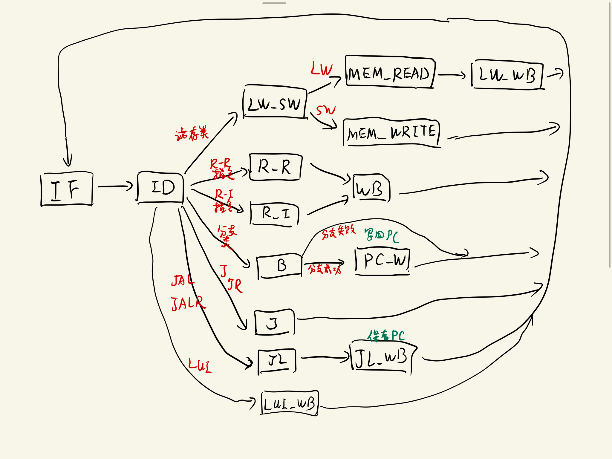

# Lab6 综合实验：基于多周期 MIPS CPU 的显示器终端

## 逻辑设计

### CPU

本次实验所采用的多周期 MIPS CPU 是在 Lab5 基础之上扩充指令集而成。支持的指令集包括：

- 访存：`lw`, `sw`

- R-R 运算：`add`, `addu`, `sub`, `subu`, `slt`, `sltu`, `sll`, `srl`, `sra`, `sllv`, `srlv`, `srav`, `and`, `or`, `xor`, `nor`

- R-I 运算：`addi`, `addiu`, `andi`, `ori`, `xori`, `lui`, `slti`, `sltiu`

- 跳转：`j`, `jal`, `jr`, `jalr`

- 分支：`beq`, `bne`, `blez`, `bgtz`, `bltz`, `bgez`

扩充指令后的 CPU 控制器状态转换图如下：

<div align="center">

</div>

### IO

采用 **memory-mapped io**，配合 **CPU polling** 的方式完成 IO。

本设计有输出设备 **VGA 显示器**，输入设备 **UART 接口**。

#### VGA

本设计适配 `800x600 @ 60Hz` 的显示器，一屏显示的字符数为 `80x24`。支持显示所有的可见 ASCII 字符(`0x40`~`0x7E`)，以及换行(`0x0D`)和光标。

实现字符的显示分为两个组件：

1. 从 `0xDFFC` 开始的 1920 个 word 的内存地址空间指定为 VRAM, 每个 word 的 `[7:0]` 储存需要显示的字符的 ASCII 码，在 VRAM 中以**先行后列**的方式储存。

2. VGA 模块根据当前扫描显示的位置，读取 VRAM 中的 ASCII 码，再从 VGA 模块中内置的
**字模 ROM**读取字模，传送显示数据至显示器。

CPU 中通过修改 VRAM 的数据，改变显示器现实的内容。

#### UART

CPU 通过 UART 接收从计算机发送来的字符 ASCII 码（字符从计算机键盘上输入）。

内存地址 `0xDFF8` 的 word 指定为与 UART 模块通信的 `uart_word`. 从 UART 中读取数据的流程如下：

1. 把 `uart_word[31]` 置为 0.

2. 循环读取 `uart_word`, 当 `uart_word[31]` 变为 1 时，代表 UART 数据已准备好，跳至第 3 步。

3. `uart_word[7:0]` 即为读取到的 ASCII 码

以此写出的读字符 `get_char` 例程如下：

```mips
    .data

uart_addr:  .word   0x0000DFF8   # uart 的地址
ready_mask: .word   0x80000000
char_mask:  .word   0x000000FF

    .text

# 读字符函数
get_char:
    lw   $t0, uart_addr
    lw   $t1, ready_mask
uart_ready_check:
    lw   $v0, 0($t0)
    and  $t2, $v0, $t1
    beq  $t2, $zero, uart_ready_check
    sw   $zero, 0($t0)
    lw   $t0, char_mask
    and  $v0, $v0, $t0
    jr   $ra
```

## 核心代码

### CPU

CPU 的设计大体与与 Lab5 一致，此处仅展示**控制器**的代码（其余代码见附件）:

> 源文件见 Control.v

```verilog
module Control (
    input clk,
    input rst,
    input [31:0] inst,
    input [2:0] nzp,	// 用于分支

    // PC 相关
    output reg [1:0] PCSrc,
    output PCWrite,

    // Mem 相关
    output MASrc,
    output MemWrite,
    output IRWrite,
    output MDRWrite,

    // reg 相关
    output reg [1:0] RegWASrc,
    output RegRead,
    output RegWrite,
    output reg [1:0] RegWDSrc,

    // ALU 相关
    output reg [1:0] ALUSrcA,
    output reg [2:0] ALUSrcB,
    output reg [3:0] ALUOp,
    output ALUOutWrite,

    // DDU
    output DDU_in_IF
    );

    assign DDU_in_IF = state==IF;

    wire [5:0] op,funct;
    wire [4:0] spec;

    assign op = inst[31:26];
    assign funct = inst[5:0];
    assign spec = inst[20:16];

    parameter
        OP_LW='h23,
        OP_SW='h2B,

        OP_R_JR_JALR='h0,
        FUNCT_JR='h8,
        FUNCT_JALR='h9,

        OP_ADDI='h8,
        OP_ADDIU='h9,
        OP_ANDI='hC,
        OP_ORI='hD,
        OP_XORI='hE,
        OP_SLTI='hA,
        OP_SLTIU='hB,

        OP_LUI='hF,

        OP_BEQ='h4,
        OP_BNE='h5,
        OP_BLEZ='h6,
        OP_BGTZ='h7,

        OP_BLTZ_BGEZ='h1,
        SPEC_BLTZ='h0,
        SPEC_BGEZ='h1,

        OP_J='h2,
        OP_JAL='h3,

        FUNCT_ADD='h20,
        FUNCT_ADDU='h21,
        FUNCT_SUB='h22,
        FUNCT_SUBU='h23,
        FUNCT_SLT='h2A,
        FUNCT_SLTU='h2B,
        FUNCT_SLL='h0,
        FUNCT_SRL='h2,
        FUNCT_SRA='h3,
        FUNCT_SLLV='h4,
        FUNCT_SRLV='h6,
        FUNCT_SRAV='h7,
        FUNCT_AND='h24,
        FUNCT_OR='h25,
        FUNCT_XOR='h26,
        FUNCT_NOR='h27;

    reg [4:0] state;

    parameter
        IF=1,       // inst fetch
        ID=2,       // inst decode

        R_R=3,      // R_R inst ALU
        R_I=4,      // R_I inst ALU
        R_R_WB=5,
        R_I_WB=6,

        J=7,
        JR=8,
        JAL=9,
        JALR=10,

        B=11,
        BZ=12,
        B_PC=13,

        LW_SW=14,
        MEM_READ=15,
        MEM_WRITE=16,
        LW_WB=17,

        LUI_WB=18,

        ERROR=0;

    // 状态转换
    always @(posedge clk or posedge rst) begin
        if(rst) begin
            state <= IF;
        end
        else begin
            case (state)
                IF: state <= ID;
                ID: begin
                    // 根据 op 和 funct 更改
                    case (op)
                        OP_LW: state <= LW_SW;
                        OP_SW: state <= LW_SW;
                        OP_R_JR_JALR: begin
                            case (funct)
                                FUNCT_JR: state <= JR;
                                FUNCT_JALR: state <=FUNCT_JALR;
                                default : state <= R_R;
                            endcase
                        end
                        OP_ADDI: state <= R_I;
                        OP_ADDIU: state <= R_I;
                        OP_ANDI: state <= R_I;
                        OP_ORI: state <= R_I;
                        OP_XORI: state <= R_I;
                        OP_SLTI: state <= R_I;
                        OP_SLTIU: state <= R_I;
                        OP_LUI: state <= LUI_WB;
                        OP_BEQ: state <= B;
                        OP_BNE: state <= B;
                        OP_BLEZ: state <= BZ;
                        OP_BGTZ: state <= BZ;
                        OP_BLTZ_BGEZ: state <= BZ;
                        OP_J: state <= J;
                        OP_JAL: state <= JAL;
                        default: state <= ERROR;
                    endcase
                end
                R_R: state <= R_R_WB;
                R_I: state <= R_I_WB;
                R_R_WB: state <= IF;
                R_I_WB: state <= IF;
                J: state <= IF;
                JR: state <= IF;
                JAL: state <= IF;
                JALR: state <= IF;
                B: begin
                    // 根据判断结果
                    case (op)
                        OP_BEQ: state <= nzp[1] ? B_PC : IF;
                        OP_BNE: state <= (nzp[2]|nzp[0]) ? B_PC : IF;
                        default: state <= ERROR;
                    endcase
                end
                BZ: begin
                    // 根据判断结果
                    case (op)
                        OP_BLEZ: state <= (nzp[2]|nzp[1]) ? B_PC : IF;
                        OP_BGTZ: state <= nzp[0] ? B_PC : IF;
                        OP_BLTZ_BGEZ: begin
                            case (spec)
                                SPEC_BLTZ: state <= nzp[2] ? B_PC : IF;
                                SPEC_BGEZ: state <= (nzp[1]|nzp[0]) ? B_PC : IF;
                                default: state <= ERROR;
                            endcase
                        end
                        default: state <= ERROR;
                    endcase
                end
                B_PC: state <= IF;
                LW_SW: begin
                    // 根据 op 判断
                    case (op)
                        OP_LW: state <= MEM_READ;
                        OP_SW: state <= MEM_WRITE;
                        default: state <= ERROR;
                    endcase
                end
                MEM_READ: state <= LW_WB;
                MEM_WRITE: state <= IF;
                LW_WB: state <= IF;
                LUI_WB: state <= IF;
                default: state <= ERROR;
            endcase
        end
    end

    assign PCWrite = |{ state==IF, state==J, state==JR, state==JAL, state==JALR, state==B_PC};
    // PCSrc:
    // 0: S  1: rs  2: J_imm
    always @(*) begin
        case (state)
            IF: PCSrc = 0;
            B_PC: PCSrc = 0;
            J: PCSrc = 2;
            JR: PCSrc = 1;
            JAL: PCSrc = 2;
            JALR: PCSrc = 1;
            default: PCSrc = 0;
        endcase
    end

    // MASrc:
    // 0: PC  1: ALU
    assign MASrc = state==MEM_READ || state==MEM_WRITE;
    assign MemWrite = state==MEM_WRITE;
    assign IRWrite = state==IF;
    assign MDRWrite = state==MEM_READ;

    assign RegRead = state==ID;
    assign RegWrite = |{state==LW_WB, state==R_R_WB, state==R_I_WB, state==LUI_WB, state==JAL, state==JALR};
    // RegWASrc:
    // 0: rd  1: rt  2:31
    always @(*) begin
        case (state)
            R_R_WB: RegWASrc = 0;
            R_I_WB: RegWASrc =1;
            LW_WB: RegWASrc = 1;
            LUI_WB: RegWASrc = 1;
            JAL: RegWASrc = 2;
            JALR: RegWASrc = 0;
            default: RegWASrc = 0;
        endcase
    end
    // RegWDSrc:
    // 0: ALU  1: MDR  2: PC   3: imm<<16
    always @(*) begin
        case (state)
            R_R_WB: RegWDSrc = 0;
            R_I_WB: RegWDSrc = 0;
            LW_WB: RegWDSrc = 1;
            LUI_WB: RegWDSrc = 3;
            JAL: RegWDSrc =2;
            JALR: RegWDSrc =2;
            default: RegWDSrc = 0;
        endcase
    end

    // ALUSrcA
    // 0: rs  1:PC  2:shift
    always @(*) begin
        case (state)
            IF: ALUSrcA = 1;
            // 移位指令特殊处理
            R_R: ALUSrcA = |{funct==FUNCT_SLL, funct==FUNCT_SRL, funct==FUNCT_SRA} ? 2 : 0;
            R_I: ALUSrcA = 0;
            B: ALUSrcA = 0;
            BZ: ALUSrcA = 0;
            B_PC: ALUSrcA = 1;
            LW_SW: ALUSrcA = 0;
            default: ALUSrcA = 0;
        endcase
    end

    // ALUSrcB
    // 0:rt  1: sext(imm16)  2: sext(imm16)<<2
    // 3:zext(imm16)  4:4  5:0
    always @(*) begin
        case (state)
            IF: ALUSrcB = 4;
            R_R: ALUSrcB = 0;
            // ANDI ORI XORI 需要 zimm
            R_I: ALUSrcB = |{op==OP_ANDI, op==OP_ORI, op==OP_XORI} ? 3 : 1;
            B: ALUSrcB = 0;
            BZ: ALUSrcB = 5;
            B_PC: ALUSrcB = 2;
            LW_SW: ALUSrcB = 1;
            default: ALUSrcB = 0;
        endcase
    end

    assign ALUOutWrite = |{state==R_R, state==R_I, state==LW_SW};

    // ALU op 码
    parameter
        ALU_OP_ADD=1,
        ALU_OP_SUB=2,
        ALU_OP_SLT=5,
        ALU_OP_SLTU=6,
        ALU_OP_SLL=7,
        ALU_OP_SRL=8,
        ALU_OP_SRA=9,
        ALU_OP_AND=10,
        ALU_OP_OR=11,
        ALU_OP_XOR=12,
        ALU_OP_NOR=13;

    // ALUOp
    always @(*) begin
        case (state)
            IF: ALUOp = ALU_OP_ADD;
            R_R: begin
                case (funct)
                    FUNCT_ADD: ALUOp = ALU_OP_ADD;
                    FUNCT_ADDU: ALUOp = ALU_OP_ADD;
                    FUNCT_SUB: ALUOp = ALU_OP_SUB;
                    FUNCT_SUBU: ALUOp = ALU_OP_SUB;
                    FUNCT_SLT: ALUOp = ALU_OP_SLT;
                    FUNCT_SLTU: ALUOp = ALU_OP_SLTU;
                    FUNCT_SLL: ALUOp = ALU_OP_SLL;
                    FUNCT_SRL: ALUOp = ALU_OP_SRL;
                    FUNCT_SRA: ALUOp = ALU_OP_SRA;
                    FUNCT_SLLV: ALUOp = ALU_OP_SLL;
                    FUNCT_SRLV: ALUOp = ALU_OP_SRL;
                    FUNCT_SRAV: ALUOp = ALU_OP_SRA;
                    FUNCT_AND: ALUOp = ALU_OP_AND;
                    FUNCT_OR: ALUOp = ALU_OP_OR;
                    FUNCT_XOR: ALUOp = ALU_OP_XOR;
                    FUNCT_NOR: ALUOp = ALU_OP_NOR;
                    default : ALUOp = 0;
                endcase
            end
            R_I: begin
                case (op)
                    OP_ADDI: ALUOp = ALU_OP_ADD;
                    OP_ADDIU: ALUOp = ALU_OP_ADD;
                    OP_ANDI: ALUOp = ALU_OP_AND;
                    OP_ORI: ALUOp = ALU_OP_OR;
                    OP_XORI: ALUOp = ALU_OP_XOR;
                    OP_SLTI: ALUOp = ALU_OP_SLT;
                    OP_SLTIU: ALUOp = ALU_OP_SLTU;
                    default: ALUOp = 0;
                endcase
            end
            B: ALUOp = ALU_OP_SUB; 
            BZ: ALUOp = ALU_OP_SUB;
            B_PC: ALUOp = ALU_OP_ADD;
            LW_SW: ALUOp = ALU_OP_ADD;
            default: ALUOp = 0;
        endcase
    end

endmodule
```

### Memory

由于采用了 `memory-mapped` 的 IO 方式，Memory 模块由 `RAM`, `VRAM`, `UART` 三部分封装而成。

`RAM` 和 `VRAM` 都由 IP 核 `Distributed Memory` 例化实现。

`UART` 模块代码如下：

> 源文件见 UART.v

```verilog
module uart_rx
    #(parameter CLKS_PER_BIT = 781)
    (
    input        i_Clock,            // Connect to memory clock for better performance
    input        i_Rx_Serial,
    input        i_Rx_Next,          // Start to detect for the next if high
    output       o_Rx_DV,            // Assert when data ready
    output [7:0] o_Rx_Byte
    );

    localparam s_IDLE           = 3'b000;
    localparam s_RX_START_BIT   = 3'b001;
    localparam s_RX_DATA_BITS   = 3'b010;
    localparam s_RX_STOP_BIT    = 3'b011;
    localparam s_WAIT_FOR_NEXT  = 3'b100;
    localparam s_WAIT_FOR_NEXT_1  = 3'b110;
    localparam s_CLEANUP        = 3'b101;

    reg           r_Rx_Data_R = 1'b1;
    reg           r_Rx_Data   = 1'b1;

    reg [31:0]    r_Clock_Count = 0;
    reg [2:0]     r_Bit_Index   = 0; //8 bits total
    reg [7:0]     r_Rx_Byte     = 0; //bits read
    reg           r_Rx_DV       = 0;
    reg [2:0]     r_SM_Main     = 0;

    // Purpose: Double-register the incoming data.
    // This allows it to be used in the UART RX Clock Domain.
    // (It removes problems caused by metastability)
    always @(posedge i_Clock)
    begin
        r_Rx_Data_R <= i_Rx_Serial;
        r_Rx_Data   <= r_Rx_Data_R;
    end


    // Purpose: Control RX state machine
    always @(posedge i_Clock)
    begin

        case (r_SM_Main)
        s_IDLE :
            begin
            r_Rx_DV       <= 1'b0;
            r_Clock_Count <= 0;
            r_Bit_Index   <= 0;

            if (r_Rx_Data == 1'b0)          // Start bit detected and 
                r_SM_Main <= s_RX_START_BIT;
            else
                r_SM_Main <= s_IDLE;
            end

        // Check middle of start bit to make sure it's still low
        s_RX_START_BIT :
            begin
            if (r_Clock_Count == (CLKS_PER_BIT-1)/2)
                begin
                if (r_Rx_Data == 1'b0)
                    begin
                    r_Clock_Count <= 0;  // reset counter, found the middle
                    r_SM_Main     <= s_RX_DATA_BITS;
                    end
                else
                    r_SM_Main <= s_IDLE;
                end
            else
                begin
                r_Clock_Count <= r_Clock_Count + 1;
                r_SM_Main     <= s_RX_START_BIT;
                end
            end // case: s_RX_START_BIT

        // Wait CLKS_PER_BIT-1 clock cycles to sample serial data
        s_RX_DATA_BITS :
            begin
            if (r_Clock_Count < CLKS_PER_BIT-1)
                begin
                r_Clock_Count <= r_Clock_Count + 1;
                r_SM_Main     <= s_RX_DATA_BITS;
                end
            else
                begin
                r_Clock_Count          <= 0;
                r_Rx_Byte[r_Bit_Index] <= r_Rx_Data;

                // Check if we have received all bits
                if (r_Bit_Index < 7)
                    begin
                    r_Bit_Index <= r_Bit_Index + 1;
                    r_SM_Main   <= s_RX_DATA_BITS;
                    end
                else
                    begin
                    r_Bit_Index <= 0;
                    r_SM_Main   <= s_RX_STOP_BIT;
                    end
                end
            end // case: s_RX_DATA_BITS

        // Receive Stop bit.  Stop bit = 1
        s_RX_STOP_BIT :
            begin
            // Wait CLKS_PER_BIT-1 clock cycles for Stop bit to finish
            // However we can call our little CPU earlier

            if (r_Clock_Count < CLKS_PER_BIT-1)
                begin
                r_Clock_Count <= r_Clock_Count + 1;
                r_SM_Main     <= s_RX_STOP_BIT;
                end
            else
                begin
                r_Clock_Count <= 0;
                r_Rx_DV           <= 1'b1;
                r_SM_Main     <= s_WAIT_FOR_NEXT;
                end
            end // case: s_RX_STOP_BIT

        s_WAIT_FOR_NEXT:
            begin

            if (i_Rx_Next)
                begin
                // Okay, we can go to CLEANUP
                r_SM_Main     <= s_CLEANUP;
                end
            else
                begin
                r_SM_Main     <= s_WAIT_FOR_NEXT;
                end
            end

        s_WAIT_FOR_NEXT_1:
            begin
            if (i_Rx_Next==1)
                begin
                // Okay, we can go to CLEANUP
                r_SM_Main     <= s_CLEANUP;
                end
            else
                begin
                r_SM_Main     <= s_WAIT_FOR_NEXT_1;
                end
            end

        // Stay here 1 clock
        s_CLEANUP :
            begin
            r_SM_Main <= s_IDLE;
            r_Rx_DV   <= 1'b0;
            end

        default :
            r_SM_Main <= s_IDLE;

        endcase
    end

    assign o_Rx_DV   = r_Rx_DV;
    assign o_Rx_Byte = r_Rx_Byte;

endmodule // uart_rx


module UART (
    input mem_wen,
    input mem_clk,
    input rst,
    input [31:0] mem_wdata,
    output [31:0] mem_rdata,

    // UART Lines
    output i_Rx_Next,
    input o_Rx_DV,
    input [7:0] o_Rx_Byte

);

    wire ready_bit;
    reg ready_bit_prev;
    assign mem_rdata[31]    =   o_Rx_DV;    // Ready bit
    assign mem_rdata[7:0]   =   o_Rx_Byte;
    assign mem_rdata[30:8]  =   23'b0;
    assign i_Rx_Next = ~ready_bit;
    assign ready_bit = rst ? 1'b1 : mem_wen ? mem_wdata[31] :o_Rx_DV;

endmodule
```

三个模块封装的 Memory 模块如下：

> 源文件见 Memory.v

```verilog
module Memory(
    input rst,

    // 内存接口
    input clk,
    input [31:0] addr,
    input [31:0] din,
    input we,
    output reg [31:0] dout,

    // UART
    input UART_TXD_IN,

    // VGA
    input clk_vram,
    input [31:0] addr_vram,
    output [7:0] dout_vram,

    // DDU
    input clk_ddu,
    input [31:0] addr_ddu,
    output [31:0] dout_ddu
    );

    // mem map 地址
    parameter
        UART_ADDR=32'hDFF8,
        VRAM_START=32'hDFFC,
        VRAM_END=32'hFFFC;

    wire in_ram, in_vram, in_uart;
    assign in_uart = addr==UART_ADDR;
    assign in_vram = addr>=VRAM_START && addr<=VRAM_END;
    assign in_ram = ~(in_uart | in_vram);

    wire [31:0] dout_cpu_ram, dout_cpu_vram, dout_cpu_uart;

    RAM ram(
        .a(addr[11:2]),
        .d(din),
        .clk(clk),
        .we(in_ram&we),
        .spo(dout_cpu_ram),

        .dpra(addr_ddu[11:2]),
        .dpo(dout_ddu)
        );

    wire [31:0] addr_cpu_vram;
    assign addr_cpu_vram = addr-VRAM_START;
    VRAM vram(
        .a(addr_cpu_vram[12:2]),
        .d(din),
        .clk(clk),
        .we(in_vram&we),
        .spo(dout_cpu_vram[7:0]),

        .dpra(addr_vram[12:2]),
        .dpo(dout_vram)
        );

    wire uart_i_Rx_Next;
    wire uart_o_Rx_DV;
    wire [7:0] uart_o_Rx_Byte;

    UART uart(
        .mem_wen(in_uart&we),
        .mem_clk(clk),
        .rst(rst),
        .mem_wdata(din),
        .mem_rdata(dout_cpu_uart),

        // UART
        .i_Rx_Next(uart_i_Rx_Next),
        .o_Rx_DV(uart_o_Rx_DV),
        .o_Rx_Byte(uart_o_Rx_Byte)
        );

    uart_rx uart_rx_inst(
        .i_Clock(clk),
        .i_Rx_Serial(UART_TXD_IN),
        .i_Rx_Next(uart_i_Rx_Next),
        .o_Rx_DV(uart_o_Rx_DV),
        .o_Rx_Byte(uart_o_Rx_Byte)
        );

    always @(*) begin
        if(in_ram) begin
            dout = dout_cpu_ram;
        end
        else if(in_vram) begin
            dout = dout_cpu_vram;
        end
        else if(in_uart) begin
            dout = dout_cpu_uart;
        end
        else begin
            dout = 0;
        end
    end

endmodule
```

### VGA

VGA 模块中的字模 ROM，每个字模是 `10x25` 的，ROM 以 ASCII 码作为地址，读取 250 位的字模数据。**ASCII 码 `0x7F` 指定为光标。**

**字模文件 `font.coe` 见附件。**

VGA 模块代码如下：

> 源文件见 VGA.v

```verilog
module VGA(
    input CLK100MHZ,
    output [3:0] VGA_R,
    output [3:0] VGA_G,
    output [3:0] VGA_B,
    output VGA_HS,
    output VGA_VS,

    output clk_vram,
    output [31:0] addr_vram,
    input [7:0] data_vram

    );

    wire CLK40MHZ;

    CLK_CVT_100M_40M cvt(
        .CLK100MHZ(CLK100MHZ),
        .CLK40MHZ(CLK40MHZ)
        );

    assign clk_vram = CLK40MHZ;

    // 800x600 @ 60Hz
    parameter HSync=128;
    parameter HBackPorch=88;
    parameter HActive=800;
    parameter HFrontPorch=40;

    parameter VSync=4;
    parameter VBackPorch=23;
    parameter VActive=600;
    parameter VFrontPorch=1;

    reg [15:0] V_count, H_count;

    wire [15:0] raw, col;

    always @(posedge CLK40MHZ) begin
        if(H_count==HSync+HBackPorch+HActive+HFrontPorch-1) begin
            H_count=0;
            if(V_count==VSync+VBackPorch+VActive+VFrontPorch-1) begin
                V_count=0;
            end
            else begin
                V_count=V_count+1;
            end
        end
        else begin
            H_count=H_count+1;
        end
    end

    assign col = H_count-HSync-HBackPorch;
    assign raw = V_count-VSync-VBackPorch;

    // 800x600 @ 60Hz
    assign VGA_HS = H_count < HSync;
    assign VGA_VS = V_count < VSync;

    // 位于显示区域中
    wire de;
    assign de = (H_count>=HSync+HBackPorch) && (H_count<HSync+HBackPorch+HActive)
            && (V_count>=VSync+VBackPorch) && (V_count<VSync+VBackPorch+VActive);

    parameter H_CHAR_NUM=80;
    parameter V_CHAR_NUM=24;
    parameter H_CHAR_SZIE=10;
    parameter V_CHAR_SIZE=25;

    assign addr_vram[17:2] = raw / V_CHAR_SIZE * H_CHAR_NUM + col / H_CHAR_SZIE;

    // 读出的字模
    wire [H_CHAR_SZIE*V_CHAR_SIZE-1:0] font;

    wire [7:0] char;
    assign char = data_vram[7:0];

    // 异步读字模
    Font_ROM font_rom(
        .a(char[6:0]),
        .spo(font)
        );

    wire [15:0] font_addr;
    assign font_addr =raw % V_CHAR_SIZE * H_CHAR_SZIE + col % H_CHAR_SZIE;

    wire pixel;
    assign pixel = font[font_addr[7:0]];

    assign VGA_R = (de&pixel) ? 'hF : 0;
    assign VGA_G = (de&pixel) ? 'hF : 0;
    assign VGA_B = (de&pixel) ? 'hF : 0;

endmodule
```

### 程序

运行在 MIPS CPU 上的程序如下：

> 原文件见 terminal.s

```mips
    .align  4

    .text

    .globl  __start

__start:

    add  $s0, $zero, $zero
    add  $s1, $zero, $zero

input_loop:

    # 加上光标
    jal  get_real_addr
    lw   $t0, ascii_cursor
    sw   $t0, 0($v0)

    jal  get_char

    # 删除当前光标
    add  $s7, $v0, $zero
    jal  get_real_addr
    sw   $zero, 0($v0)
    add  $v0, $s7, $zero

    # 判断字符是否是 \n
judge_enter:
    lw   $t0, ascii_enter
    bne  $v0, $t0, judge_back
    # 回车
    jal  new_line
    j    input_loop
judge_back:
    lw   $t0, ascii_back
    bne  $v0, $t0, judge_else
    # 退格
    jal  exec_back
    j    input_loop
judge_else:
    # 常规字符
    add  $s7, $v0, $zero
    jal  get_real_addr
    sw   $s7, 0($v0)

    # 更新光标位置
    jal  fresh_cursor

    j    input_loop


# 更新光标
fresh_cursor:
    lw   $t0, raw_num  # 最大行数
    lw   $t1, col_num  # 最大列数
    addi $s1, $s1, 1
last_col:
    bne  $s1, $t1, end_fresh
    add  $s6, $ra, $zero
    jal  new_line
    add  $ra, $s6, $zero
end_fresh:
    jr   $ra


# 换行函数
new_line:
    lw   $t0, raw_num   # 最大行数
    addi $s0, $s0, 1
last_line:
    bne  $s0, $t0, else_line
    add  $s7, $ra, $zero
    jal  mv_screen  # 滚动屏幕
    add  $ra, $s7, $zero
    lw   $t0, raw_num
    addi $s0, $t0, -1
    add  $s1, $zero, $zero
    j    new_line_end
else_line:
    add  $s1, $zero, $zero
new_line_end:
    jr   $ra


# back 函数
exec_back:   # 非第一列
    beq  $s1, $zero, first_col
    addi $s1, $s1, -1
    j    exec_back_rest
first_col:   # 第一列
    beq  $s0, $zero, exec_back_end
    addi $s0, $s0, -1
    lw   $s1, col_num
    addi $s1, $s1, -1
exec_back_rest:   # 删除字符
    add  $s7, $ra, $zero
    jal  get_real_addr
    add  $ra, $s7, $zero
    sw   $zero, 0($v0)
exec_back_end:
    jr   $ra


# 滚动屏幕函数
mv_screen:
    lw   $t0, vram_start   # 目标位置
    lw   $t1, col_num
    sll  $t1, $t1, 2
    add  $t1, $t1, $t0     # 源位置
    lw   $t2, total_num
    sll  $t2, $t2, 2
    add  $t2, $t2, $t0     # 最后位置
mv_loop:
    beq  $t1, $t2, clr_last_line_loop
    lw   $t7, 0($t1)
    sw   $t7, 0($t0)
    addi $t0, $t0, 4
    addi $t1, $t1, 4
    j    mv_loop

    # 还需要清空最后一行
clr_last_line_loop:
    beq  $t0, $t2, mv_end
    sw   $zero, 0($t0)
    addi $t0, $t0, 4
    j    clr_last_line_loop
mv_end:
    jr   $ra


# 根据行列数获得指向的内存地址  vram_start[$s0][$s1]=vram+($s0*col_num+$s1)<<2
get_real_addr:
    add  $t0, $zero, $zero
    add  $t1, $zero, $zero
    lw   $t2, col_num
mult_loop:
    beq  $t1, $t2, mult_end
    add  $t0, $t0, $s0
    addi $t1, $t1, 1
    j    mult_loop
mult_end:
    add  $t0, $t0, $s1
    sll  $t0, $t0, 2
    lw   $v0, vram_start
    add  $v0, $v0, $t0
    jr   $ra


# 读字符函数
get_char:
    lw   $t0, uart_addr
    lw   $t1, ready_mask
uart_ready_check:
    lw   $v0, 0($t0)
    and  $t2, $v0, $t1
    beq  $t2, $zero, uart_ready_check
    sw   $zero, 0($t0)
    lw   $t0, char_mask
    and  $v0, $v0, $t0
    jr   $ra

    .data

vram_start: .word   0x0000DFFC   # VRAM 起始地址
raw_num:    .word   24
col_num:    .word   80
total_num:  .word   1920

ascii_enter: .word   0x0D
ascii_back:  .word  0x7F
ascii_cursor: .word  0x7F   # 显示的光标的 ascii 码

uart_addr:  .word   0x0000DFF8   # uart 的地址
ready_mask: .word   0x80000000
char_mask:  .word   0x000000FF
```

执行

```shell
mipsel-linux-gnu-as terminal.s -o terminal.o -O0
```

汇编，再执行

```shell
mipsel-linux-gnu-ld terminal.o -o terminal.elf -Ttext=0 -Tdata=0x290
```

完成链接。然后使用 `mipsel-linux-gnu-objdump` 提取其中的 `.text` 段和 `.data` 段，生成 coe 文件。

> 见附件 terminal.coe

然后使用 coe 文件初始化 RAM.

## 下载结果

下载到开发板后，使用 USB 线将开发板连接到计算机，使用 VGA 线连接到显示器。

计算机上运行 `RealTerm` 软件，连接到开发板的 UART 端口，如下：

<div align="center">

</div>

在此软件上打字，开发板即可收到字符，显示到屏幕上。

**演示视频见附件 show.mp4**

## 结果分析

本次实验扩充了上次使用的多周期 MIPS CPU 所支持的指令集，并支持了 Memory-mapped IO. 以此加深了对对计算机 IO 系统的了解。
